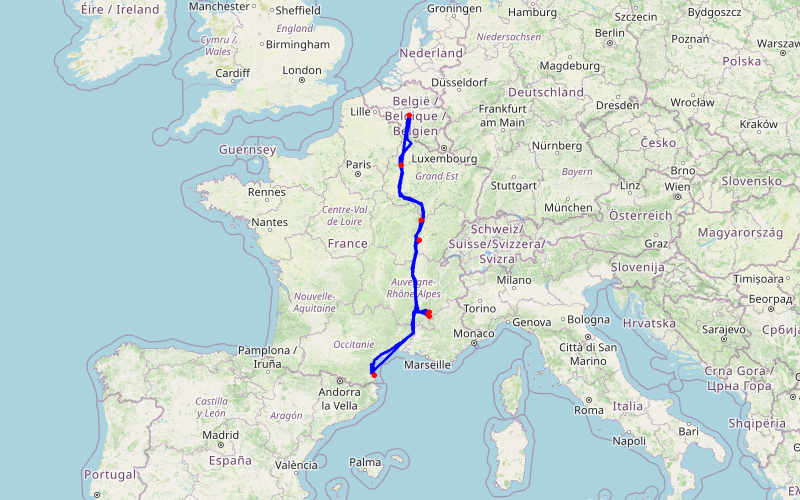

# Barnave & Brasilia

🌐 Public · 06/06/2025 → 06/07/2025 · 30 jours · 2,538.7 km · 🇧🇪 🇫🇷

_Vacances de Juin avec un passage a Barnave les 50 ans 1er fois et Brasilia _

---

## 📊 Résumé

| | |
|:---|---:|
| **Date début** | 06/06/2025 |
| **Date fin** | 06/07/2025 |
| **Durée** | 30 jours |
| **Distance** | 2,538.7 km |
| **Étapes GPS** | 621 |
| **Étapes nommées** | 11 |
| **Pays visités** | 🇧🇪 🇫🇷 |
| **Visibilité** | 🌐 Public |
| **Pays** | 🇫🇷 FR, 🇧🇪 BE |

## 🗺️ Carte du trajet

---

---

## 🗺️ Itinéraire — Étapes

### 1. Reims  — 07/06/2025

 *⛅ 18°C*

---

### 2. Is-Sur-Tille — 07/06/2025

 *⛅ 21°C*

---

### 3. Recoubeau-Jansac — 08/06/2025

_Nous sommes donc pour 3 jours au camping 🏕️ Les Écureuils. _

 *☀️ 24°C*

---

### 4. Châtillon en Diois — 09/06/2025

 *☀️ 24°C*

---

### 5. Luc-en-Diois — 09/06/2025

 *☀️ 27°C*

---

### 6. Col de Penne — 10/06/2025

 *☀️ 30°C*

---

### 7. Camping Le Brasilia  — 11/06/2025

 *☀️ 32°C*

---

### 8. Canet-en-Roussillon — 11/06/2025

 *☀️ 32°C*

---

### 9. Plage — 20/06/2025

 *☀️ 34°C*

---

### 10. Verdun sur le Doubs — 05/07/2025

_Arrêt dans le camping car Park. L'endroit est vraiment très bien avec WC et Douche. _

 *☀️ 31°C*

---

### 11. Maison - Sombreffe  — 06/07/2025

_Fin de notre périple Barnave-Le Brasilia - très bonnes vacances avec de jolies étapes. _

 *⛅ 18°C*

---

## 📍 Traces GPS complètes

610 points de tracking automatique :

Afficher la trace GPS

| # | Lieu | Coordonnées | Date | Vitesse |
|:--:|------|:-----------:|:----:|:-------:|
| 1 | Sombreffe | [50.5355, 4.6039](https://maps.google.com/?q=50.5354975,4.6038941) | 07/06/2025 | |
| 2 | Sombreffe | [50.5267, 4.5983](https://maps.google.com/?q=50.5266725,4.5982914) | 07/06/2025 | |
| 3 | Sombreffe | [50.5285, 4.5885](https://maps.google.com/?q=50.52845084667206,4.588457345962524) | 07/06/2025 | |
| 4 | Sombreffe | [50.5357, 4.6039](https://maps.google.com/?q=50.53570306301117,4.603893041610718) | 07/06/2025 | |
| 5 | Sombreffe | [50.5343, 4.6045](https://maps.google.com/?q=50.5343354,4.604506) | 07/06/2025 | |
| 6 | Namur | [50.5076, 4.5922](https://maps.google.com/?q=50.5076396,4.5922243) | 07/06/2025 | |
| 7 | Ransart | [50.4701, 4.4995](https://maps.google.com/?q=50.4700873,4.4994977) | 07/06/2025 | |
| 8 | Charleroi | [50.3786, 4.4829](https://maps.google.com/?q=50.3786298,4.4829279) | 07/06/2025 | |
| 9 | Philippeville | [50.3151, 4.4788](https://maps.google.com/?q=50.3150808,4.4787994) | 07/06/2025 | |
| 10 | Philippeville | [50.2677, 4.5012](https://maps.google.com/?q=50.2676664,4.5011631) | 07/06/2025 | |
| 11 | Reims | [49.1204, 4.2429](https://maps.google.com/?q=49.1204242,4.2429101) | 07/06/2025 | |
| 12 | Reims | [49.1221, 4.2447](https://maps.google.com/?q=49.122073482390256,4.2447109974519) | 07/06/2025 | |
| 13 | Reims | [49.1208, 4.2455](https://maps.google.com/?q=49.1208099,4.2454633) | 07/06/2025 | |
| 14 | Juvigny | [49.0130, 4.2959](https://maps.google.com/?q=49.0130219,4.2959126) | 07/06/2025 | |
| 15 | Nuisement-sur-Coole | [48.8789, 4.2899](https://maps.google.com/?q=48.8788775,4.2899389) | 07/06/2025 | |
| 16 | Breuvery-sur-Coole | [48.8398, 4.2877](https://maps.google.com/?q=48.83978138414275,4.287745297433095) | 07/06/2025 | |
| 17 | Sommesous | [48.7528, 4.2316](https://maps.google.com/?q=48.7527568,4.2315612) | 07/06/2025 | |
| 18 | Trouans | [48.6276, 4.1814](https://maps.google.com/?q=48.6275838,4.1813616) | 07/06/2025 | |
| 19 | Le Chêne | [48.5588, 4.1942](https://maps.google.com/?q=48.558843596008444,4.194213724414327) | 07/06/2025 | |
| 20 | St.-Remy-sous-Barbuise | [48.4946, 4.1648](https://maps.google.com/?q=48.4945793,4.1647993) | 07/06/2025 | |
| 21 | Luyères | [48.3597, 4.1624](https://maps.google.com/?q=48.3596775,4.1624025) | 07/06/2025 | |
| 22 | Rouilly-Saint-Loup | [48.2605, 4.1655](https://maps.google.com/?q=48.26054204068997,4.1654719151296185) | 07/06/2025 | |
| 23 | Clérey | [48.2277, 4.1842](https://maps.google.com/?q=48.2276899,4.184201) | 07/06/2025 | |
| 24 | Fresnoy-le-Château | [48.2190, 4.2247](https://maps.google.com/?q=48.21898950509212,4.224660968352758) | 07/06/2025 | |
| 25 | Marolles-lès-Bailly | [48.1727, 4.3585](https://maps.google.com/?q=48.1727407,4.3585245) | 07/06/2025 | |
| 26 | Magnant | [48.1780, 4.4371](https://maps.google.com/?q=48.177962015927214,4.437066616392448) | 07/06/2025 | |
| 27 | Beurey | [48.1709, 4.4686](https://maps.google.com/?q=48.170895,4.4685698) | 07/06/2025 | |
| 28 | Vitry-le-Croisé | [48.1698, 4.5581](https://maps.google.com/?q=48.1698102,4.5581368) | 07/06/2025 | |
| 29 | Laferté-sur-Aube | [48.1161, 4.7384](https://maps.google.com/?q=48.1161495,4.7384096) | 07/06/2025 | |
| 30 | Laferté-sur-Aube | [48.1149, 4.7453](https://maps.google.com/?q=48.114922,4.7453496) | 07/06/2025 | |
| 31 | Châteauvillain | [48.0629, 4.9241](https://maps.google.com/?q=48.0629437,4.9241205) | 07/06/2025 | |
| 32 | Foulain | [48.0133, 5.1005](https://maps.google.com/?q=48.0132867,5.1005233) | 07/06/2025 | |
| 33 | Beauchemin | [47.9088, 5.2227](https://maps.google.com/?q=47.9087959,5.2227129) | 07/06/2025 | |
| 34 | Perrogney | [47.8859, 5.2226](https://maps.google.com/?q=47.88589462560949,5.222572987851197) | 07/06/2025 | |
| 35 | Aprey | [47.7755, 5.2094](https://maps.google.com/?q=47.7755188,5.2093788) | 07/06/2025 | |
| 36 | Selongey | [47.6471, 5.1784](https://maps.google.com/?q=47.6471169,5.1784199) | 07/06/2025 | |
| 37 | Selongey | [47.6003, 5.2022](https://maps.google.com/?q=47.600348825677436,5.202240244158532) | 07/06/2025 | |
| 38 | Til-Châtel | [47.5368, 5.1922](https://maps.google.com/?q=47.5368191,5.1921695) | 07/06/2025 | |
| 39 | Dijon | [47.5202, 5.1216](https://maps.google.com/?q=47.5201739,5.121575) | 07/06/2025 | |
| 40 | Dijon | [47.5132, 5.1126](https://maps.google.com/?q=47.51321218566373,5.112646089248375) | 07/06/2025 | |
| 41 | Savigny-le-Sec | [47.4227, 5.0662](https://maps.google.com/?q=47.4227074,5.0661839) | 08/06/2025 | |
| 42 | Dijon | [47.3513, 5.0707](https://maps.google.com/?q=47.3512743,5.0707398) | 08/06/2025 | |
| 43 | Dijon | [47.2785, 5.0458](https://maps.google.com/?q=47.27849375211174,5.04578148137911) | 08/06/2025 | |
| 44 | Perrigny-lès-Dijon | [47.2468, 5.0292](https://maps.google.com/?q=47.2467997,5.0291755) | 08/06/2025 | |
| 45 | Beaune | [47.1905, 4.9972](https://maps.google.com/?q=47.1904788,4.9971715) | 08/06/2025 | |
| 46 | Beaune | [47.0807, 4.9291](https://maps.google.com/?q=47.080700754453154,4.92905022928129) | 08/06/2025 | |
| 47 | Ladoix-Serrigny | [47.0670, 4.9179](https://maps.google.com/?q=47.067048,4.9178716) | 08/06/2025 | |
| 48 | Beaune | [46.9439, 4.8275](https://maps.google.com/?q=46.9439129,4.8274667) | 08/06/2025 | |
| 49 | Fragnes | [46.8259, 4.8309](https://maps.google.com/?q=46.825856447248164,4.830926304277273) | 08/06/2025 | |
| 50 | Champforgeuil | [46.8138, 4.8277](https://maps.google.com/?q=46.81383268565264,4.827727372158723) | 08/06/2025 | |
| 51 | Chalon-sur-Saône | [46.6911, 4.8439](https://maps.google.com/?q=46.6911413,4.8439077) | 08/06/2025 | |
| 52 | Tournus | [46.5636, 4.8962](https://maps.google.com/?q=46.5636219,4.8962044) | 08/06/2025 | |
| 53 | Vérizet | [46.4365, 4.8697](https://maps.google.com/?q=46.43647,4.8696818) | 08/06/2025 | |
| 54 | Mâcon | [46.4170, 4.8636](https://maps.google.com/?q=46.417011189493344,4.863614207193942) | 08/06/2025 | |
| 55 | Charnay-lès-Mâcon | [46.3107, 4.7950](https://maps.google.com/?q=46.3106943,4.7949567) | 08/06/2025 | |
| 56 | Saint-Romain-des-Îles | [46.2271, 4.7918](https://maps.google.com/?q=46.2271032,4.791826) | 08/06/2025 | |
| 57 | Saint-Romain-des-Îles | [46.1751, 4.7699](https://maps.google.com/?q=46.1751182,4.7698645) | 08/06/2025 | |
| 58 | Dracé | [46.1431, 4.7677](https://maps.google.com/?q=46.14308165067532,4.767673113955363) | 08/06/2025 | |
| 59 | Dracé | [46.1412, 4.7675](https://maps.google.com/?q=46.141207296780834,4.7674674703787145) | 08/06/2025 | |
| 60 | Belleville | [46.1089, 4.7587](https://maps.google.com/?q=46.1088993,4.7587364) | 08/06/2025 | |
| 61 | Limas | [45.9770, 4.7350](https://maps.google.com/?q=45.976986,4.73503) | 08/06/2025 | |
| 62 | Lissieu | [45.8577, 4.7418](https://maps.google.com/?q=45.8577472,4.7418221) | 08/06/2025 | |
| 63 | Lissieu | [45.8439, 4.7495](https://maps.google.com/?q=45.84392765584758,4.749519814979176) | 08/06/2025 | |
| 64 | Lyon | [45.7652, 4.8001](https://maps.google.com/?q=45.7652369,4.800078) | 08/06/2025 | |
| 65 | Pierre-Bénite | [45.7042, 4.8338](https://maps.google.com/?q=45.704161,4.8338037) | 08/06/2025 | |
| 66 | Feyzin | [45.6801, 4.8475](https://maps.google.com/?q=45.68008068309729,4.847532221185569) | 08/06/2025 | |
| 67 | Ternay | [45.5976, 4.7960](https://maps.google.com/?q=45.5975968,4.7959909) | 08/06/2025 | |
| 68 | Vienne | [45.4910, 4.8326](https://maps.google.com/?q=45.4909709,4.8325934) | 08/06/2025 | |
| 69 | Vienne | [45.4362, 4.8245](https://maps.google.com/?q=45.436204775537824,4.824522176835273) | 08/06/2025 | |
| 70 | Cheyssieu | [45.4268, 4.8241](https://maps.google.com/?q=45.42682858334797,4.824055673989304) | 08/06/2025 | |
| 71 | Roussillon | [45.3947, 4.8080](https://maps.google.com/?q=45.3946837,4.8080221) | 08/06/2025 | |
| 72 | Albon | [45.2638, 4.8361](https://maps.google.com/?q=45.2638403,4.8360849) | 08/06/2025 | |
| 73 | Saint-Barthélemy-de-Vals | [45.1571, 4.8884](https://maps.google.com/?q=45.15710592183018,4.888432190563771) | 08/06/2025 | |
| 74 | Mercurol | [45.1362, 4.8932](https://maps.google.com/?q=45.1362201,4.8931883) | 08/06/2025 | |
| 75 | Châteauneuf-sur-Isère | [44.9987, 4.8768](https://maps.google.com/?q=44.9986968,4.8767635) | 08/06/2025 | |
| 76 | Valence | [44.9022, 4.8840](https://maps.google.com/?q=44.90224,4.8840036) | 08/06/2025 | |
| 77 | Valence | [44.9003, 4.8879](https://maps.google.com/?q=44.90025063493798,4.887853687717297) | 08/06/2025 | |
| 78 | Étoile-sur-Rhône | [44.8276, 4.9096](https://maps.google.com/?q=44.827607,4.9095557) | 08/06/2025 | |
| 79 | Eurre | [44.7460, 4.9867](https://maps.google.com/?q=44.7459557,4.9866739) | 08/06/2025 | |
| 80 | Crest | [44.7373, 5.0026](https://maps.google.com/?q=44.73731502841668,5.002619630316784) | 08/06/2025 | |
| 81 | Aouste-sur-Sye | [44.7109, 5.0564](https://maps.google.com/?q=44.7108939278621,5.0563571098290065) | 08/06/2025 | |
| 82 | Saillans | [44.6925, 5.1859](https://maps.google.com/?q=44.6925054,5.1859141) | 08/06/2025 | |
| 83 | Vercheny | [44.6902, 5.2378](https://maps.google.com/?q=44.69019179091883,5.237812614760684) | 08/06/2025 | |
| 84 | Pontaix | [44.7304, 5.2670](https://maps.google.com/?q=44.730436,5.2670278) | 08/06/2025 | |
| 85 | Die | [44.7622, 5.3506](https://maps.google.com/?q=44.7622251,5.3505627) | 08/06/2025 | |
| 86 | Aix-en-Diois | [44.7257, 5.3967](https://maps.google.com/?q=44.7256975,5.3967349) | 08/06/2025 | |
| 87 | Aix-en-Diois | [44.7083, 5.4012](https://maps.google.com/?q=44.70832568420892,5.401168822124304) | 08/06/2025 | |
| 88 | Die | [44.6791, 5.3928](https://maps.google.com/?q=44.6790606,5.3928255) | 08/06/2025 | |
| 89 | Barnave | [44.6607, 5.3731](https://maps.google.com/?q=44.6606855,5.3731091) | 08/06/2025 | |
| 90 | Barnave | [44.6601, 5.3713](https://maps.google.com/?q=44.6601282,5.3713309) | 08/06/2025 | |
| 91 | Barnave | [44.6607, 5.3731](https://maps.google.com/?q=44.6606678,5.3730887) | 08/06/2025 | |
| 92 | Recoubeau-Jansac | [44.6526, 5.4125](https://maps.google.com/?q=44.652584236890945,5.412541132428977) | 08/06/2025 | |
| 93 | Recoubeau-Jansac | [44.6524, 5.4124](https://maps.google.com/?q=44.652449108978225,5.412396036082142) | 09/06/2025 | |
| 94 | Menglon | [44.6629, 5.4390](https://maps.google.com/?q=44.6628942,5.4389504) | 09/06/2025 | |
| 95 | Menglon | [44.6638, 5.4614](https://maps.google.com/?q=44.66378,5.4614477) | 09/06/2025 | |
| 96 | Menglon | [44.6728, 5.4745](https://maps.google.com/?q=44.6727884310181,5.474466573391464) | 09/06/2025 | |
| 97 | Menglon | [44.6762, 5.4747](https://maps.google.com/?q=44.676248,5.4746961) | 09/06/2025 | |
| 98 | Châtillon-en-Diois | [44.6873, 5.4738](https://maps.google.com/?q=44.6873108,5.4737624) | 09/06/2025 | |
| 99 | Châtillon-en-Diois | [44.6913, 5.4752](https://maps.google.com/?q=44.6912779,5.4751617) | 09/06/2025 | |
| 100 | Châtillon-en-Diois | [44.6952, 5.4853](https://maps.google.com/?q=44.6951759,5.4852559) | 09/06/2025 | |
| 101 | Châtillon-en-Diois | [44.6877, 5.4657](https://maps.google.com/?q=44.6877268,5.4656741) | 09/06/2025 | |
| 102 | Menglon | [44.6824, 5.4466](https://maps.google.com/?q=44.6824161,5.4465617) | 09/06/2025 | |
| 103 | Die | [44.6773, 5.4436](https://maps.google.com/?q=44.67725907051534,5.443584754361154) | 09/06/2025 | |
| 104 | Recoubeau-Jansac | [44.6656, 5.4274](https://maps.google.com/?q=44.6655777,5.4274422) | 09/06/2025 | |
| 105 | Recoubeau-Jansac | [44.6521, 5.4123](https://maps.google.com/?q=44.6521197,5.4122754) | 09/06/2025 | |
| 106 | Recoubeau-Jansac | [44.6534, 5.4130](https://maps.google.com/?q=44.653436889146455,5.412983974814) | 09/06/2025 | |
| 107 | Recoubeau-Jansac | [44.6589, 5.4186](https://maps.google.com/?q=44.6588649,5.4186109) | 09/06/2025 | |
| 108 | Menglon | [44.6509, 5.4325](https://maps.google.com/?q=44.6509127,5.4325231) | 09/06/2025 | |
| 109 | Luc-en-Diois | [44.6197, 5.4486](https://maps.google.com/?q=44.619691816590745,5.448588477787019) | 09/06/2025 | |
| 110 | Luc-en-Diois | [44.5997, 5.4590](https://maps.google.com/?q=44.5996825,5.4589852) | 09/06/2025 | |
| 111 | Luc-en-Diois | [44.6013, 5.4619](https://maps.google.com/?q=44.6012684,5.4619341) | 09/06/2025 | |
| 112 | Luc-en-Diois | [44.6010, 5.4592](https://maps.google.com/?q=44.6009978,5.4591679) | 09/06/2025 | |
| 113 | Luc-en-Diois | [44.6032, 5.4578](https://maps.google.com/?q=44.603172123582745,5.457808678001154) | 09/06/2025 | |
| 114 | Luc-en-Diois | [44.6061, 5.4550](https://maps.google.com/?q=44.6061331,5.4550117) | 09/06/2025 | |
| 115 | Montlaur-en-Diois | [44.6278, 5.4342](https://maps.google.com/?q=44.6277838,5.4341621) | 09/06/2025 | |
| 116 | Montlaur-en-Diois | [44.6419, 5.4216](https://maps.google.com/?q=44.64189956720514,5.421565666532135) | 09/06/2025 | |
| 117 | Recoubeau-Jansac | [44.6519, 5.4138](https://maps.google.com/?q=44.6518549,5.4138359) | 09/06/2025 | |
| 118 | Recoubeau-Jansac | [44.6524, 5.4122](https://maps.google.com/?q=44.6523731,5.4122288) | 09/06/2025 | |
| 119 | Recoubeau-Jansac | [44.6536, 5.4129](https://maps.google.com/?q=44.6536454,5.4129025) | 10/06/2025 | |
| 120 | Barnave | [44.6705, 5.3929](https://maps.google.com/?q=44.6704695,5.3928587) | 10/06/2025 | |
| 121 | Barnave | [44.6613, 5.3723](https://maps.google.com/?q=44.6612691,5.3722648) | 10/06/2025 | |
| 122 | Barnave | [44.6541, 5.3655](https://maps.google.com/?q=44.6541013,5.3655303) | 10/06/2025 | |
| 123 | Barnave | [44.6513, 5.3596](https://maps.google.com/?q=44.651298968678496,5.359605009816448) | 10/06/2025 | |
| 124 | Barnave | [44.6492, 5.3669](https://maps.google.com/?q=44.6491537,5.3669488) | 10/06/2025 | |
| 125 | Barnave | [44.6462, 5.3638](https://maps.google.com/?q=44.6462493,5.3638354) | 10/06/2025 | |
| 126 | Barnave | [44.6462, 5.3603](https://maps.google.com/?q=44.64617966720728,5.360326963142255) | 10/06/2025 | |
| 127 | Barnave | [44.6460, 5.3584](https://maps.google.com/?q=44.645999415527285,5.358363326300476) | 10/06/2025 | |
| 128 | Barnave | [44.6510, 5.3591](https://maps.google.com/?q=44.6510097,5.3591445) | 10/06/2025 | |
| 129 | Barnave | [44.6569, 5.3634](https://maps.google.com/?q=44.65690337006362,5.363400171811948) | 10/06/2025 | |
| 130 | Barnave | [44.6612, 5.3721](https://maps.google.com/?q=44.66123840707851,5.37214462703693) | 10/06/2025 | |
| 131 | Barnave | [44.6614, 5.3742](https://maps.google.com/?q=44.66135931810684,5.374178680235059) | 10/06/2025 | |
| 132 | Die | [44.6635, 5.3818](https://maps.google.com/?q=44.663491812661356,5.381803405974702) | 10/06/2025 | |
| 133 | Recoubeau-Jansac | [44.6612, 5.4082](https://maps.google.com/?q=44.661228003093385,5.4082122665471415) | 10/06/2025 | |
| 134 | Recoubeau-Jansac | [44.6522, 5.4125](https://maps.google.com/?q=44.65222998943204,5.412522132749262) | 10/06/2025 | |
| 135 | Recoubeau-Jansac | [44.6536, 5.4127](https://maps.google.com/?q=44.6536279,5.4127101) | 10/06/2025 | |
| 136 | Recoubeau-Jansac | [44.6522, 5.4125](https://maps.google.com/?q=44.65224442548296,5.412477419287142) | 10/06/2025 | |
| 137 | Recoubeau-Jansac | [44.6524, 5.4126](https://maps.google.com/?q=44.652389883995056,5.412583947181702) | 10/06/2025 | |
| 138 | Recoubeau-Jansac | [44.6543, 5.4126](https://maps.google.com/?q=44.65431112808558,5.4125637745129875) | 11/06/2025 | |
| 139 | Solaure en Diois | [44.7262, 5.3959](https://maps.google.com/?q=44.7262086,5.3959451) | 11/06/2025 | |
| 140 | Die | [44.7617, 5.3530](https://maps.google.com/?q=44.7616711,5.3530232) | 11/06/2025 | |
| 141 | Pontaix | [44.7398, 5.2661](https://maps.google.com/?q=44.739796758484246,5.2661185601252045) | 11/06/2025 | |
| 142 | Saillans | [44.6927, 5.1868](https://maps.google.com/?q=44.6927014,5.1867925) | 11/06/2025 | |
| 143 | Aouste-sur-Sye | [44.7095, 5.0632](https://maps.google.com/?q=44.7095471,5.0631925) | 11/06/2025 | |
| 144 | Chabrillan | [44.7236, 4.9672](https://maps.google.com/?q=44.72363892398722,4.96723043365675) | 11/06/2025 | |
| 145 | Die | [44.7242, 4.9557](https://maps.google.com/?q=44.7241549,4.955749) | 11/06/2025 | |
| 146 | Loriol-sur-Drôme | [44.7611, 4.8385](https://maps.google.com/?q=44.7610737,4.8385423) | 11/06/2025 | |
| 147 | Loriol-sur-Drôme | [44.7598, 4.8352](https://maps.google.com/?q=44.759801783595,4.835177290865325) | 11/06/2025 | |
| 148 | Nyons | [44.7195, 4.7856](https://maps.google.com/?q=44.7194929,4.7855731) | 11/06/2025 | |
| 149 | Nyons | [44.5827, 4.8040](https://maps.google.com/?q=44.5827236,4.8040122) | 11/06/2025 | |
| 150 | Nyons | [44.5151, 4.7802](https://maps.google.com/?q=44.51511030196716,4.780242638399668) | 11/06/2025 | |
| 151 | Donzère | [44.4325, 4.7442](https://maps.google.com/?q=44.43248562876001,4.744232123011728) | 11/06/2025 | |
| 152 | Bollène | [44.2970, 4.7464](https://maps.google.com/?q=44.2969754,4.746425) | 11/06/2025 | |
| 153 | Piolenc | [44.1764, 4.7565](https://maps.google.com/?q=44.1763784,4.7564937) | 11/06/2025 | |
| 154 | Roquemaure | [44.0476, 4.7645](https://maps.google.com/?q=44.0476027,4.7645377) | 11/06/2025 | |
| 155 | Nîmes | [43.9561, 4.6263](https://maps.google.com/?q=43.9561458,4.6263092) | 11/06/2025 | |
| 156 | Saint-Gervasy | [43.8808, 4.4712](https://maps.google.com/?q=43.8807614,4.4712176) | 11/06/2025 | |
| 157 | Nîmes | [43.8026, 4.3177](https://maps.google.com/?q=43.8025824,4.317733) | 11/06/2025 | |
| 158 | Gallargues-le-Montueux | [43.7254, 4.1749](https://maps.google.com/?q=43.7254051,4.1749402) | 11/06/2025 | |
| 159 | Montpellier | [43.7133, 4.1302](https://maps.google.com/?q=43.713341870514604,4.130191323617363) | 11/06/2025 | |
| 160 | Montpellier | [43.7141, 4.1322](https://maps.google.com/?q=43.71409130204071,4.13215548946899) | 11/06/2025 | |
| 161 | Saint-Aunès | [43.6443, 3.9764](https://maps.google.com/?q=43.6443111,3.97644) | 11/06/2025 | |
| 162 | Saint-Jean-de-Védas | [43.5606, 3.8281](https://maps.google.com/?q=43.5606192,3.8280697) | 11/06/2025 | |
| 163 | Montpellier | [43.4800, 3.6725](https://maps.google.com/?q=43.4799887,3.6724788) | 11/06/2025 | |
| 164 | Pinet | [43.4105, 3.5066](https://maps.google.com/?q=43.4104897,3.506644) | 11/06/2025 | |
| 165 | Béziers | [43.3537, 3.3358](https://maps.google.com/?q=43.3537037,3.3358119) | 11/06/2025 | |
| 166 | Lespignan | [43.2735, 3.1818](https://maps.google.com/?q=43.2734915,3.1817556) | 11/06/2025 | |
| 167 | Narbonne | [43.1794, 3.0409](https://maps.google.com/?q=43.1794463,3.0409442) | 11/06/2025 | |
| 168 | Narbonne | [43.1575, 2.9879](https://maps.google.com/?q=43.15754852156252,2.98785299087603) | 11/06/2025 | |
| 169 | Sigean | [43.0697, 2.9378](https://maps.google.com/?q=43.0697315,2.9378336) | 11/06/2025 | |
| 170 | Sigean | [43.0672, 2.9373](https://maps.google.com/?q=43.06723114024433,2.9372552319351697) | 11/06/2025 | |
| 171 | Caves | [42.9400, 2.9683](https://maps.google.com/?q=42.9400082,2.968287) | 11/06/2025 | |
| 172 | Leucate | [42.9232, 3.0179](https://maps.google.com/?q=42.92321595273508,3.017935860679827) | 11/06/2025 | |
| 173 | Perpignan | [42.7999, 3.0291](https://maps.google.com/?q=42.7999067,3.0291191) | 11/06/2025 | |
| 174 | Canet-en-Roussillon | [42.7119, 3.0240](https://maps.google.com/?q=42.7119172,3.0239965) | 11/06/2025 | |
| 175 | Canet-en-Roussillon | [42.7086, 3.0357](https://maps.google.com/?q=42.70861659472584,3.0357316044740283) | 11/06/2025 | |
| 176 | Canet-en-Roussillon | [42.7105, 3.0362](https://maps.google.com/?q=42.71054422638707,3.036241238285315) | 11/06/2025 | |
| 177 | Canet-en-Roussillon | [42.7091, 3.0358](https://maps.google.com/?q=42.70908,3.0357848) | 11/06/2025 | |
| 178 | Canet-en-Roussillon | [42.7078, 3.0348](https://maps.google.com/?q=42.7078282,3.0347527) | 11/06/2025 | |
| 179 | Canet-en-Roussillon | [42.7077, 3.0343](https://maps.google.com/?q=42.7076843,3.0342792) | 11/06/2025 | |
| 180 | Canet-en-Roussillon | [42.7085, 3.0358](https://maps.google.com/?q=42.7084567,3.0357855) | 11/06/2025 | |
| 181 | Canet-en-Roussillon | [42.7104, 3.0361](https://maps.google.com/?q=42.7104367,3.0361167) | 11/06/2025 | |
| 182 | Canet-en-Roussillon | [42.7106, 3.0362](https://maps.google.com/?q=42.71055054664612,3.036157011985779) | 11/06/2025 | |
| 183 | Canet-en-Roussillon | [42.7084, 3.0357](https://maps.google.com/?q=42.7084273,3.0356982) | 11/06/2025 | |
| 184 | Canet-en-Roussillon | [42.7098, 3.0359](https://maps.google.com/?q=42.7097748,3.0359409) | 11/06/2025 | |
| 185 | Canet-en-Roussillon | [42.7096, 3.0384](https://maps.google.com/?q=42.70960247516632,3.0384408235549927) | 12/06/2025 | |
| 186 | Canet-en-Roussillon | [42.7120, 3.0374](https://maps.google.com/?q=42.71199858188629,3.0374197959899902) | 12/06/2025 | |
| 187 | Canet-en-Roussillon | [42.7105, 3.0362](https://maps.google.com/?q=42.7105125,3.03616) | 12/06/2025 | |
| 188 | Canet-en-Roussillon | [42.7092, 3.0356](https://maps.google.com/?q=42.7091632,3.0356497) | 12/06/2025 | |
| 189 | Canet-en-Roussillon | [42.7079, 3.0340](https://maps.google.com/?q=42.7079068,3.0340216) | 12/06/2025 | |
| 190 | Canet-en-Roussillon | [42.7084, 3.0357](https://maps.google.com/?q=42.70845,3.0357243) | 12/06/2025 | |
| 191 | Canet-en-Roussillon | [42.7106, 3.0362](https://maps.google.com/?q=42.7105776,3.0362098) | 12/06/2025 | |
| 192 | Canet-en-Roussillon | [42.7093, 3.0372](https://maps.google.com/?q=42.70925426483154,3.0372233390808105) | 12/06/2025 | |
| 193 | Canet-en-Roussillon | [42.7105, 3.0361](https://maps.google.com/?q=42.7104654,3.0361357) | 12/06/2025 | |
| 194 | Canet-en-Roussillon | [42.7081, 3.0340](https://maps.google.com/?q=42.7080773,3.034003) | 12/06/2025 | |
| 195 | Canet-en-Roussillon | [42.7069, 3.0330](https://maps.google.com/?q=42.706906493208876,3.033025960809652) | 12/06/2025 | |
| 196 | Canet-en-Roussillon | [42.7066, 3.0300](https://maps.google.com/?q=42.7065901,3.030019) | 12/06/2025 | |
| 197 | Canet-en-Roussillon | [42.7076, 3.0275](https://maps.google.com/?q=42.707604059355795,3.0274963206468213) | 12/06/2025 | |
| 198 | Canet-en-Roussillon | [42.7023, 3.0223](https://maps.google.com/?q=42.70231412786572,3.0222870239537323) | 12/06/2025 | |
| 199 | Canet-en-Roussillon | [42.7066, 3.0308](https://maps.google.com/?q=42.7065631,3.0307686) | 12/06/2025 | |
| 200 | Canet-en-Roussillon | [42.7099, 3.0362](https://maps.google.com/?q=42.7098923,3.0362255) | 12/06/2025 | |
| 201 | Canet-en-Roussillon | [42.7094, 3.0359](https://maps.google.com/?q=42.7094059,3.0358804) | 12/06/2025 | |
| 202 | Canet-en-Roussillon | [42.7085, 3.0384](https://maps.google.com/?q=42.7085102,3.0383735) | 13/06/2025 | |
| 203 | Canet-en-Roussillon | [42.7095, 3.0388](https://maps.google.com/?q=42.70954942703247,3.03879177570343) | 13/06/2025 | |
| 204 | Canet-en-Roussillon | [42.7070, 3.0374](https://maps.google.com/?q=42.7070089,3.0374349) | 13/06/2025 | |
| 205 | Canet-en-Roussillon | [42.7098, 3.0366](https://maps.google.com/?q=42.70978769028616,3.036635811399179) | 13/06/2025 | |
| 206 | Canet-en-Roussillon | [42.7106, 3.0361](https://maps.google.com/?q=42.710554,3.0361023) | 13/06/2025 | |
| 207 | Canet-en-Roussillon | [42.7104, 3.0367](https://maps.google.com/?q=42.710409283638,3.0367013216018677) | 13/06/2025 | |
| 208 | Canet-en-Roussillon | [42.7097, 3.0376](https://maps.google.com/?q=42.7096654,3.0375831) | 14/06/2025 | |
| 209 | Canet-en-Roussillon | [42.7024, 3.0378](https://maps.google.com/?q=42.7024009,3.0378023) | 14/06/2025 | |
| 210 | Canet-en-Roussillon | [42.7070, 3.0374](https://maps.google.com/?q=42.7070089,3.0374349) | 14/06/2025 | |
| 211 | Canet-en-Roussillon | [42.7104, 3.0367](https://maps.google.com/?q=42.7103617,3.0366737) | 14/06/2025 | |
| 212 | Canet-en-Roussillon | [42.7087, 3.0358](https://maps.google.com/?q=42.70867335796356,3.0357764959335327) | 14/06/2025 | |
| 213 | Canet-en-Roussillon | [42.7104, 3.0360](https://maps.google.com/?q=42.7104286,3.0360363) | 14/06/2025 | |
| 214 | Canet-en-Roussillon | [42.7104, 3.0360](https://maps.google.com/?q=42.7104385,3.0360337) | 14/06/2025 | |
| 215 | Canet-en-Roussillon | [42.7091, 3.0358](https://maps.google.com/?q=42.7090603,3.035837) | 14/06/2025 | |
| 216 | Canet-en-Roussillon | [42.7090, 3.0358](https://maps.google.com/?q=42.70901558136162,3.0358433410914687) | 14/06/2025 | |
| 217 | Canet-en-Roussillon | [42.7104, 3.0368](https://maps.google.com/?q=42.7103777,3.036757) | 14/06/2025 | |
| 218 | Canet-en-Roussillon | [42.7092, 3.0358](https://maps.google.com/?q=42.7091973,3.0358427) | 14/06/2025 | |
| 219 | Canet-en-Roussillon | [42.7105, 3.0361](https://maps.google.com/?q=42.7105338,3.0361325) | 14/06/2025 | |
| 220 | Canet-en-Roussillon | [42.7079, 3.0341](https://maps.google.com/?q=42.7079438,3.0341273) | 14/06/2025 | |
| 221 | Canet-en-Roussillon | [42.7094, 3.0336](https://maps.google.com/?q=42.70941933238073,3.033582935060441) | 14/06/2025 | |
| 222 | Canet-en-Roussillon | [42.7086, 3.0372](https://maps.google.com/?q=42.7085612,3.0372421) | 14/06/2025 | |
| 223 | Canet-en-Roussillon | [42.7104, 3.0360](https://maps.google.com/?q=42.71044,3.0360294) | 14/06/2025 | |
| 224 | Canet-en-Roussillon | [42.7086, 3.0366](https://maps.google.com/?q=42.70858437307742,3.036632344767163) | 14/06/2025 | |
| 225 | Canet-en-Roussillon | [42.7101, 3.0368](https://maps.google.com/?q=42.7101205,3.0367644) | 14/06/2025 | |
| 226 | Canet-en-Roussillon | [42.7090, 3.0358](https://maps.google.com/?q=42.708966,3.0357867) | 14/06/2025 | |
| 227 | Canet-en-Roussillon | [42.7080, 3.0342](https://maps.google.com/?q=42.7079788,3.0342127) | 14/06/2025 | |
| 228 | Canet-en-Roussillon | [42.7105, 3.0362](https://maps.google.com/?q=42.71054389795758,3.0361919329745133) | 14/06/2025 | |
| 229 | Canet-en-Roussillon | [42.7105, 3.0362](https://maps.google.com/?q=42.7105486,3.036225) | 14/06/2025 | |
| 230 | Canet-en-Roussillon | [42.7097, 3.0390](https://maps.google.com/?q=42.709710121154785,3.038996696472168) | 15/06/2025 | |
| 231 | Canet-en-Roussillon | [42.7096, 3.0387](https://maps.google.com/?q=42.70963180065155,3.038739323616028) | 15/06/2025 | |
| 232 | Canet-en-Roussillon | [42.7112, 3.0394](https://maps.google.com/?q=42.71123397350311,3.0393528938293457) | 15/06/2025 | |
| 233 | Canet-en-Roussillon | [42.7134, 3.0390](https://maps.google.com/?q=42.713417172431946,3.0390385389328003) | 15/06/2025 | |
| 234 | Canet-en-Roussillon | [42.7127, 3.0394](https://maps.google.com/?q=42.71273493766785,3.0393879413604736) | 15/06/2025 | |
| 235 | Canet-en-Roussillon | [42.7114, 3.0394](https://maps.google.com/?q=42.711368680000305,3.039380192756653) | 15/06/2025 | |
| 236 | Canet-en-Roussillon | [42.7096, 3.0388](https://maps.google.com/?q=42.70963799953461,3.038791298866272) | 15/06/2025 | |
| 237 | Canet-en-Roussillon | [42.7104, 3.0367](https://maps.google.com/?q=42.710377,3.0367172) | 15/06/2025 | |
| 238 | Canet-en-Roussillon | [42.7070, 3.0374](https://maps.google.com/?q=42.7070089,3.0374349) | 15/06/2025 | |
| 239 | Canet-en-Roussillon | [42.7097, 3.0387](https://maps.google.com/?q=42.709699511528015,3.0387378931045532) | 15/06/2025 | |
| 240 | Canet-en-Roussillon | [42.7097, 3.0389](https://maps.google.com/?q=42.709693908691406,3.038869619369507) | 15/06/2025 | |
| 241 | Canet-en-Roussillon | [42.7097, 3.0367](https://maps.google.com/?q=42.7097154,3.0366627) | 15/06/2025 | |
| 242 | Canet-en-Roussillon | [42.7087, 3.0353](https://maps.google.com/?q=42.7087052,3.0353356) | 15/06/2025 | |
| 243 | Canet-en-Roussillon | [42.7093, 3.0334](https://maps.google.com/?q=42.7093069,3.0334249) | 15/06/2025 | |
| 244 | Canet-en-Roussillon | [42.7105, 3.0363](https://maps.google.com/?q=42.710515,3.0362884) | 15/06/2025 | |
| 245 | Canet-en-Roussillon | [42.7091, 3.0359](https://maps.google.com/?q=42.7091177,3.0358841) | 15/06/2025 | |
| 246 | Canet-en-Roussillon | [42.7106, 3.0362](https://maps.google.com/?q=42.710555539313425,3.0362034537233127) | 15/06/2025 | |
| 247 | Canet-en-Roussillon | [42.7105, 3.0362](https://maps.google.com/?q=42.71052135973702,3.0361693428984693) | 16/06/2025 | |
| 248 | Canet-en-Roussillon | [42.7088, 3.0360](https://maps.google.com/?q=42.7088026,3.0359966) | 16/06/2025 | |
| 249 | Canet-en-Roussillon | [42.7103, 3.0367](https://maps.google.com/?q=42.71033255423691,3.0367408616885183) | 16/06/2025 | |
| 250 | Canet-en-Roussillon | [42.7095, 3.0382](https://maps.google.com/?q=42.709531866648696,3.0382275748544982) | 16/06/2025 | |
| 251 | Canet-en-Roussillon | [42.7070, 3.0374](https://maps.google.com/?q=42.7070089,3.0374349) | 16/06/2025 | |
| 252 | Canet-en-Roussillon | [42.7070, 3.0374](https://maps.google.com/?q=42.7070089,3.0374349) | 16/06/2025 | |
| 253 | Canet-en-Roussillon | [42.7096, 3.0388](https://maps.google.com/?q=42.7096437,3.0388263) | 16/06/2025 | |
| 254 | Canet-en-Roussillon | [42.7096, 3.0388](https://maps.google.com/?q=42.7096426486969,3.038829803466797) | 16/06/2025 | |
| 255 | Canet-en-Roussillon | [42.7096, 3.0388](https://maps.google.com/?q=42.709593296051025,3.038843274116516) | 16/06/2025 | |
| 256 | Canet-en-Roussillon | [42.7096, 3.0390](https://maps.google.com/?q=42.709582924842834,3.03896164894104) | 16/06/2025 | |
| 257 | Canet-en-Roussillon | [42.7097, 3.0383](https://maps.google.com/?q=42.70968043804169,3.0383224487304688) | 16/06/2025 | |
| 258 | Canet-en-Roussillon | [42.7104, 3.0361](https://maps.google.com/?q=42.7104076,3.036127) | 16/06/2025 | |
| 259 | Canet-en-Roussillon | [42.7030, 3.0227](https://maps.google.com/?q=42.70296953242871,3.0226546129305127) | 16/06/2025 | |
| 260 | Canet-en-Roussillon | [42.7095, 3.0359](https://maps.google.com/?q=42.7094947,3.0358773) | 16/06/2025 | |
| 261 | Canet-en-Roussillon | [42.7095, 3.0359](https://maps.google.com/?q=42.7095262,3.0359377) | 16/06/2025 | |
| 262 | Canet-en-Roussillon | [42.7060, 3.0365](https://maps.google.com/?q=42.7059977,3.0365383) | 17/06/2025 | |
| 263 | Canet-en-Roussillon | [42.7039, 3.0379](https://maps.google.com/?q=42.703905194547836,3.0379246858124027) | 17/06/2025 | |
| 264 | Canet-en-Roussillon | [42.7055, 3.0374](https://maps.google.com/?q=42.705521147756926,3.037373404097983) | 17/06/2025 | |
| 265 | Canet-en-Roussillon | [42.7093, 3.0333](https://maps.google.com/?q=42.709286942397,3.0333012435966515) | 17/06/2025 | |
| 266 | Canet-en-Roussillon | [42.7102, 3.0346](https://maps.google.com/?q=42.7102231,3.0346242) | 17/06/2025 | |
| 267 | Canet-en-Roussillon | [42.7106, 3.0364](https://maps.google.com/?q=42.71061730384827,3.03638756275177) | 17/06/2025 | |
| 268 | Canet-en-Roussillon | [42.7079, 3.0341](https://maps.google.com/?q=42.7078875,3.0340501) | 18/06/2025 | |
| 269 | Perpignan | [42.7327, 3.0249](https://maps.google.com/?q=42.73267,3.0248932) | 18/06/2025 | |
| 270 | Leucate | [42.8849, 3.0499](https://maps.google.com/?q=42.88485491275787,3.049893856048584) | 18/06/2025 | |
| 271 | Saint-Laurent-de-la-Salanque | [42.7712, 3.0173](https://maps.google.com/?q=42.77121555805206,3.017281413078308) | 18/06/2025 | |
| 272 | Canet-en-Roussillon | [42.7079, 3.0339](https://maps.google.com/?q=42.70786261558533,3.033908724784851) | 18/06/2025 | |
| 273 | Canet-en-Roussillon | [42.7106, 3.0362](https://maps.google.com/?q=42.71055409499856,3.0362407508698244) | 18/06/2025 | |
| 274 | Canet-en-Roussillon | [42.7096, 3.0381](https://maps.google.com/?q=42.7096203,3.0381149) | 18/06/2025 | |
| 275 | Canet-en-Roussillon | [42.7070, 3.0374](https://maps.google.com/?q=42.7070089,3.0374349) | 18/06/2025 | |
| 276 | Canet-en-Roussillon | [42.7096, 3.0387](https://maps.google.com/?q=42.70960342884064,3.038746476173401) | 18/06/2025 | |
| 277 | Canet-en-Roussillon | [42.7097, 3.0387](https://maps.google.com/?q=42.70968198776245,3.0387014150619507) | 18/06/2025 | |
| 278 | Canet-en-Roussillon | [42.7070, 3.0374](https://maps.google.com/?q=42.7070089,3.0374349) | 18/06/2025 | |
| 279 | Canet-en-Roussillon | [42.7097, 3.0389](https://maps.google.com/?q=42.709656834602356,3.038897395133972) | 18/06/2025 | |
| 280 | Canet-en-Roussillon | [42.7096, 3.0388](https://maps.google.com/?q=42.709614396095276,3.0387861728668213) | 18/06/2025 | |
| 281 | Canet-en-Roussillon | [42.7096, 3.0388](https://maps.google.com/?q=42.709638833999634,3.0387613773345947) | 18/06/2025 | |
| 282 | Canet-en-Roussillon | [42.7098, 3.0365](https://maps.google.com/?q=42.7097756,3.0365456) | 18/06/2025 | |
| 283 | Canet-en-Roussillon | [42.7086, 3.0356](https://maps.google.com/?q=42.7086119,3.03561) | 18/06/2025 | |
| 284 | Canet-en-Roussillon | [42.7037, 3.0309](https://maps.google.com/?q=42.7036537,3.0309193) | 18/06/2025 | |
| 285 | Canet-en-Roussillon | [42.7057, 3.0311](https://maps.google.com/?q=42.70567717400928,3.0310876062342658) | 18/06/2025 | |
| 286 | Canet-en-Roussillon | [42.7082, 3.0346](https://maps.google.com/?q=42.7082118,3.0346277) | 18/06/2025 | |
| 287 | Canet-en-Roussillon | [42.7092, 3.0359](https://maps.google.com/?q=42.709214,3.0358672) | 18/06/2025 | |
| 288 | Canet-en-Roussillon | [42.7106, 3.0362](https://maps.google.com/?q=42.7105567,3.0362421) | 18/06/2025 | |
| 289 | Canet-en-Roussillon | [42.7096, 3.0382](https://maps.google.com/?q=42.7095989,3.0382024) | 19/06/2025 | |
| 290 | Canet-en-Roussillon | [42.7084, 3.0359](https://maps.google.com/?q=42.7083834,3.0358521) | 19/06/2025 | |
| 291 | Canet-en-Roussillon | [42.7099, 3.0368](https://maps.google.com/?q=42.7098936,3.0367919) | 19/06/2025 | |
| 292 | Canet-en-Roussillon | [42.7103, 3.0361](https://maps.google.com/?q=42.71032953262329,3.0361225605010986) | 19/06/2025 | |
| 293 | Canet-en-Roussillon | [42.7095, 3.0384](https://maps.google.com/?q=42.70954210148487,3.0383946286737262) | 19/06/2025 | |
| 294 | Canet-en-Roussillon | [42.7067, 3.0374](https://maps.google.com/?q=42.7067037,3.0374349) | 19/06/2025 | |
| 295 | Canet-en-Roussillon | [42.7095, 3.0388](https://maps.google.com/?q=42.709527134895325,3.038822054862976) | 19/06/2025 | |
| 296 | Canet-en-Roussillon | [42.7098, 3.0368](https://maps.google.com/?q=42.7097724,3.0368091) | 19/06/2025 | |
| 297 | Canet-en-Roussillon | [42.7085, 3.0361](https://maps.google.com/?q=42.70852117756706,3.0360519315069214) | 19/06/2025 | |
| 298 | Canet-en-Roussillon | [42.7099, 3.0363](https://maps.google.com/?q=42.7098661,3.0362505) | 19/06/2025 | |
| 299 | Canet-en-Roussillon | [42.7097, 3.0389](https://maps.google.com/?q=42.709683418273926,3.0389033555984497) | 20/06/2025 | |
| 300 | Canet-en-Roussillon | [42.7096, 3.0388](https://maps.google.com/?q=42.7095818,3.038833) | 20/06/2025 | |
| 301 | Canet-en-Roussillon | [42.7082, 3.0384](https://maps.google.com/?q=42.708205,3.0383735) | 20/06/2025 | |
| 302 | Canet-en-Roussillon | [42.7096, 3.0382](https://maps.google.com/?q=42.7096167,3.0382063) | 20/06/2025 | |
| 303 | Canet-en-Roussillon | [42.7106, 3.0362](https://maps.google.com/?q=42.7105675,3.0361897) | 20/06/2025 | |
| 304 | Canet-en-Roussillon | [42.7105, 3.0362](https://maps.google.com/?q=42.710528759125225,3.036180067498603) | 20/06/2025 | |
| 305 | Canet-en-Roussillon | [42.7095, 3.0374](https://maps.google.com/?q=42.7094958,3.0373956) | 20/06/2025 | |
| 306 | Canet-en-Roussillon | [42.7086, 3.0360](https://maps.google.com/?q=42.7085795,3.0360032) | 20/06/2025 | |
| 307 | Canet-en-Roussillon | [42.7105, 3.0362](https://maps.google.com/?q=42.7105448,3.0361904) | 20/06/2025 | |
| 308 | Canet-en-Roussillon | [42.7100, 3.0367](https://maps.google.com/?q=42.7100079,3.0367107) | 20/06/2025 | |
| 309 | Canet-en-Roussillon | [42.7089, 3.0357](https://maps.google.com/?q=42.7088798,3.0356959) | 21/06/2025 | |
| 310 | Canet-en-Roussillon | [42.7000, 3.0219](https://maps.google.com/?q=42.6999894,3.0218798) | 21/06/2025 | |
| 311 | Canet-en-Roussillon | [42.7011, 3.0204](https://maps.google.com/?q=42.70108411479627,3.020381648327506) | 21/06/2025 | |
| 312 | Canet-en-Roussillon | [42.7001, 3.0232](https://maps.google.com/?q=42.7000921,3.0232353) | 21/06/2025 | |
| 313 | Canet-en-Roussillon | [42.7069, 3.0313](https://maps.google.com/?q=42.7068692,3.0313173) | 21/06/2025 | |
| 314 | Canet-en-Roussillon | [42.7084, 3.0356](https://maps.google.com/?q=42.7084494,3.0355656) | 21/06/2025 | |
| 315 | Canet-en-Roussillon | [42.7105, 3.0361](https://maps.google.com/?q=42.7104887,3.0361165) | 21/06/2025 | |
| 316 | Canet-en-Roussillon | [42.7096, 3.0382](https://maps.google.com/?q=42.7096103,3.038205) | 21/06/2025 | |
| 317 | Canet-en-Roussillon | [42.7043, 3.0377](https://maps.google.com/?q=42.7042535,3.0377478) | 21/06/2025 | |
| 318 | Canet-en-Roussillon | [42.7096, 3.0388](https://maps.google.com/?q=42.70957028865814,3.038755774497986) | 21/06/2025 | |
| 319 | Canet-en-Roussillon | [42.7097, 3.0376](https://maps.google.com/?q=42.709660708930535,3.0375607214630436) | 21/06/2025 | |
| 320 | Canet-en-Roussillon | [42.7106, 3.0362](https://maps.google.com/?q=42.71062791347504,3.036231756210327) | 21/06/2025 | |
| 321 | Canet-en-Roussillon | [42.7082, 3.0362](https://maps.google.com/?q=42.708201,3.036188) | 21/06/2025 | |
| 322 | Canet-en-Roussillon | [42.7083, 3.0344](https://maps.google.com/?q=42.708283,3.0343544) | 21/06/2025 | |
| 323 | Canet-en-Roussillon | [42.7091, 3.0359](https://maps.google.com/?q=42.7090777,3.0358552) | 21/06/2025 | |
| 324 | Canet-en-Roussillon | [42.7106, 3.0362](https://maps.google.com/?q=42.710556466144105,3.036177577682539) | 21/06/2025 | |
| 325 | Canet-en-Roussillon | [42.7096, 3.0382](https://maps.google.com/?q=42.7096103,3.038205) | 22/06/2025 | |
| 326 | Canet-en-Roussillon | [42.7096, 3.0389](https://maps.google.com/?q=42.709614992141724,3.038871169090271) | 22/06/2025 | |
| 327 | Canet-en-Roussillon | [42.7096, 3.0388](https://maps.google.com/?q=42.70958983898163,3.0388416051864624) | 22/06/2025 | |
| 328 | Canet-en-Roussillon | [42.7104, 3.0367](https://maps.google.com/?q=42.71036922202043,3.0367316853374158) | 22/06/2025 | |
| 329 | Canet-en-Roussillon | [42.7087, 3.0355](https://maps.google.com/?q=42.7087074,3.0355003) | 22/06/2025 | |
| 330 | Canet-en-Roussillon | [42.7092, 3.0372](https://maps.google.com/?q=42.70917856693268,3.037221074104309) | 22/06/2025 | |
| 331 | Canet-en-Roussillon | [42.7106, 3.0362](https://maps.google.com/?q=42.7105896,3.0361995) | 22/06/2025 | |
| 332 | Canet-en-Roussillon | [42.7092, 3.0358](https://maps.google.com/?q=42.7092198,3.0358244) | 23/06/2025 | |
| 333 | Canet-en-Roussillon | [42.7103, 3.0369](https://maps.google.com/?q=42.7103392,3.0368563) | 23/06/2025 | |
| 334 | Canet-en-Roussillon | [42.7096, 3.0388](https://maps.google.com/?q=42.70956886242134,3.0387933189212837) | 23/06/2025 | |
| 335 | Canet-en-Roussillon | [42.7095, 3.0388](https://maps.google.com/?q=42.70954430103302,3.038828492164612) | 23/06/2025 | |
| 336 | Canet-en-Roussillon | [42.7095, 3.0368](https://maps.google.com/?q=42.7094672,3.0368091) | 23/06/2025 | |
| 337 | Canet-en-Roussillon | [42.7073, 3.0374](https://maps.google.com/?q=42.7073141,3.0374349) | 23/06/2025 | |
| 338 | Canet-en-Roussillon | [42.7095, 3.0388](https://maps.google.com/?q=42.709484934806824,3.0387721061706543) | 23/06/2025 | |
| 339 | Canet-en-Roussillon | [42.7096, 3.0379](https://maps.google.com/?q=42.70963680744171,3.0379412174224854) | 23/06/2025 | |
| 340 | Canet-en-Roussillon | [42.7105, 3.0363](https://maps.google.com/?q=42.710511445999146,3.0362536907196045) | 23/06/2025 | |
| 341 | Canet-en-Roussillon | [42.7087, 3.0356](https://maps.google.com/?q=42.7087119,3.0355996) | 23/06/2025 | |
| 342 | Canet-en-Roussillon | [42.7080, 3.0223](https://maps.google.com/?q=42.708041808057565,3.0223090573811384) | 23/06/2025 | |
| 343 | Canet-en-Roussillon | [42.7014, 3.0226](https://maps.google.com/?q=42.7013769,3.0226422) | 23/06/2025 | |
| 344 | Canet-en-Roussillon | [42.7008, 3.0204](https://maps.google.com/?q=42.70077242736785,3.020374987485186) | 23/06/2025 | |
| 345 | Canet-en-Roussillon | [42.6995, 3.0231](https://maps.google.com/?q=42.6994921,3.0231318) | 23/06/2025 | |
| 346 | Canet-en-Roussillon | [42.6978, 3.0318](https://maps.google.com/?q=42.6977702,3.0317916) | 23/06/2025 | |
| 347 | Canet-en-Roussillon | [42.7025, 3.0378](https://maps.google.com/?q=42.7025131,3.0378276) | 23/06/2025 | |
| 348 | Canet-en-Roussillon | [42.7040, 3.0349](https://maps.google.com/?q=42.7039603,3.0348722) | 23/06/2025 | |
| 349 | Canet-en-Roussillon | [42.7026, 3.0382](https://maps.google.com/?q=42.702561259269714,3.0382137298583984) | 23/06/2025 | |
| 350 | Canet-en-Roussillon | [42.7014, 3.0370](https://maps.google.com/?q=42.7014313,3.0370035) | 23/06/2025 | |
| 351 | Canet-en-Roussillon | [42.7048, 3.0216](https://maps.google.com/?q=42.7047893,3.0215876) | 23/06/2025 | |
| 352 | Canet-en-Roussillon | [42.7072, 3.0339](https://maps.google.com/?q=42.707205176353455,3.0338510274887085) | 23/06/2025 | |
| 353 | Canet-en-Roussillon | [42.7105, 3.0362](https://maps.google.com/?q=42.7105486,3.036155) | 23/06/2025 | |
| 354 | Canet-en-Roussillon | [42.7084, 3.0355](https://maps.google.com/?q=42.7083829,3.0354663) | 24/06/2025 | |
| 355 | Canet-en-Roussillon | [42.7068, 3.0322](https://maps.google.com/?q=42.70678445827242,3.03215925655065) | 24/06/2025 | |
| 356 | Canet-en-Roussillon | [42.7046, 3.0214](https://maps.google.com/?q=42.704622561591535,3.0213832946019146) | 24/06/2025 | |
| 357 | Canet-en-Roussillon | [42.7024, 3.0266](https://maps.google.com/?q=42.70239047380905,3.026571686877649) | 24/06/2025 | |
| 358 | Canet-en-Roussillon | [42.7020, 3.0284](https://maps.google.com/?q=42.7020042,3.0283682) | 24/06/2025 | |
| 359 | Canet-en-Roussillon | [42.7007, 3.0316](https://maps.google.com/?q=42.700728595695296,3.0316236404341503) | 24/06/2025 | |
| 360 | Canet-en-Roussillon | [42.6995, 3.0363](https://maps.google.com/?q=42.6995498,3.0363331) | 24/06/2025 | |
| 361 | Canet-en-Roussillon | [42.6980, 3.0361](https://maps.google.com/?q=42.6980174711283,3.0360654373138387) | 24/06/2025 | |
| 362 | Canet-en-Roussillon | [42.6944, 3.0351](https://maps.google.com/?q=42.6944362,3.0351272) | 24/06/2025 | |
| 363 | Canet-en-Roussillon | [42.7007, 3.0316](https://maps.google.com/?q=42.70073156098337,3.031595012161128) | 24/06/2025 | |
| 364 | Canet-en-Roussillon | [42.7016, 3.0301](https://maps.google.com/?q=42.701552,3.0301276) | 24/06/2025 | |
| 365 | Canet-en-Roussillon | [42.7032, 3.0236](https://maps.google.com/?q=42.703153,3.0236197) | 24/06/2025 | |
| 366 | Canet-en-Roussillon | [42.7069, 3.0290](https://maps.google.com/?q=42.7069287,3.0289875) | 24/06/2025 | |
| 367 | Canet-en-Roussillon | [42.7077, 3.0354](https://maps.google.com/?q=42.7076697,3.035423) | 24/06/2025 | |
| 368 | Canet-en-Roussillon | [42.7105, 3.0362](https://maps.google.com/?q=42.71053682843678,3.036197366869702) | 24/06/2025 | |
| 369 | Canet-en-Roussillon | [42.7087, 3.0363](https://maps.google.com/?q=42.7086669,3.0362899) | 24/06/2025 | |
| 370 | Canet-en-Roussillon | [42.7096, 3.0380](https://maps.google.com/?q=42.7095843,3.0379922) | 24/06/2025 | |
| 371 | Canet-en-Roussillon | [42.7087, 3.0363](https://maps.google.com/?q=42.7086957,3.0363284) | 24/06/2025 | |
| 372 | Canet-en-Roussillon | [42.7103, 3.0368](https://maps.google.com/?q=42.7102587,3.0368173) | 24/06/2025 | |
| 373 | Canet-en-Roussillon | [42.7087, 3.0354](https://maps.google.com/?q=42.7087276,3.0354109) | 24/06/2025 | |
| 374 | Canet-en-Roussillon | [42.7090, 3.0373](https://maps.google.com/?q=42.7090116,3.0372735) | 24/06/2025 | |
| 375 | Canet-en-Roussillon | [42.7079, 3.0341](https://maps.google.com/?q=42.70788299350511,3.034096491477234) | 24/06/2025 | |
| 376 | Canet-en-Roussillon | [42.7106, 3.0362](https://maps.google.com/?q=42.710562,3.0361886) | 24/06/2025 | |
| 377 | Canet-en-Roussillon | [42.7082, 3.0384](https://maps.google.com/?q=42.708205,3.0383735) | 25/06/2025 | |
| 378 | Canet-en-Roussillon | [42.7097, 3.0388](https://maps.google.com/?q=42.709659,3.0387568) | 25/06/2025 | |
| 379 | Canet-en-Roussillon | [42.7097, 3.0388](https://maps.google.com/?q=42.709662675857544,3.038832664489746) | 25/06/2025 | |
| 380 | Canet-en-Roussillon | [42.7097, 3.0389](https://maps.google.com/?q=42.7096783,3.0388812) | 25/06/2025 | |
| 381 | Canet-en-Roussillon | [42.7082, 3.0384](https://maps.google.com/?q=42.708205,3.0383735) | 25/06/2025 | |
| 382 | Canet-en-Roussillon | [42.7105, 3.0362](https://maps.google.com/?q=42.7105309,3.036207) | 25/06/2025 | |
| 383 | Canet-en-Roussillon | [42.7089, 3.0358](https://maps.google.com/?q=42.70887753714491,3.035790351420725) | 25/06/2025 | |
| 384 | Canet-en-Roussillon | [42.7047, 3.0371](https://maps.google.com/?q=42.7047457,3.0370858) | 25/06/2025 | |
| 385 | Canet-en-Roussillon | [42.7063, 3.0367](https://maps.google.com/?q=42.70632734936643,3.03672749791281) | 25/06/2025 | |
| 386 | Canet-en-Roussillon | [42.7106, 3.0362](https://maps.google.com/?q=42.7105676,3.0361754) | 25/06/2025 | |
| 387 | Canet-en-Roussillon | [42.7088, 3.0357](https://maps.google.com/?q=42.708771645300196,3.0357189397960553) | 26/06/2025 | |
| 388 | Canet-en-Roussillon | [42.7079, 3.0341](https://maps.google.com/?q=42.7079143,3.034053) | 26/06/2025 | |
| 389 | Canet-en-Roussillon | [42.7085, 3.0357](https://maps.google.com/?q=42.7085288,3.0357083) | 26/06/2025 | |
| 390 | Canet-en-Roussillon | [42.7106, 3.0361](https://maps.google.com/?q=42.71058416366577,3.036089301109314) | 26/06/2025 | |
| 391 | Canet-en-Roussillon | [42.7088, 3.0360](https://maps.google.com/?q=42.7087783,3.0360164) | 26/06/2025 | |
| 392 | Canet-en-Roussillon | [42.7105, 3.0363](https://maps.google.com/?q=42.7105096,3.0363021) | 26/06/2025 | |
| 393 | Canet-en-Roussillon | [42.7012, 3.0308](https://maps.google.com/?q=42.70123988805537,3.0308489105384364) | 26/06/2025 | |
| 394 | Canet-en-Roussillon | [42.7064, 3.0248](https://maps.google.com/?q=42.7064006828989,3.0248391765866365) | 26/06/2025 | |
| 395 | Canet-en-Roussillon | [42.7079, 3.0341](https://maps.google.com/?q=42.7078671,3.0340512) | 26/06/2025 | |
| 396 | Canet-en-Roussillon | [42.7094, 3.0359](https://maps.google.com/?q=42.709422,3.035916) | 26/06/2025 | |
| 397 | Canet-en-Roussillon | [42.7107, 3.0365](https://maps.google.com/?q=42.71071684360504,3.03648042678833) | 26/06/2025 | |
| 398 | Canet-en-Roussillon | [42.7107, 3.0365](https://maps.google.com/?q=42.7107168,3.0364804) | 26/06/2025 | |
| 399 | Canet-en-Roussillon | [42.7089, 3.0358](https://maps.google.com/?q=42.708919614467945,3.0357823571252758) | 26/06/2025 | |
| 400 | Canet-en-Roussillon | [42.7106, 3.0362](https://maps.google.com/?q=42.710560505832284,3.036197534139754) | 26/06/2025 | |
| 401 | Canet-en-Roussillon | [42.7093, 3.0370](https://maps.google.com/?q=42.709312081336975,3.0370320081710815) | 26/06/2025 | |
| 402 | Canet-en-Roussillon | [42.7106, 3.0363](https://maps.google.com/?q=42.7106248,3.0362958) | 26/06/2025 | |
| 403 | Canet-en-Roussillon | [42.7047, 3.0215](https://maps.google.com/?q=42.70465017746703,3.0214892016446098) | 26/06/2025 | |
| 404 | Canet-en-Roussillon | [42.7047, 3.0216](https://maps.google.com/?q=42.7047034,3.02163) | 26/06/2025 | |
| 405 | Canet-en-Roussillon | [42.7061, 3.0223](https://maps.google.com/?q=42.706057618763865,3.0223378052472647) | 26/06/2025 | |
| 406 | Canet-en-Roussillon | [42.7101, 3.0367](https://maps.google.com/?q=42.7100715,3.0367218) | 26/06/2025 | |
| 407 | Canet-en-Roussillon | [42.7095, 3.0388](https://maps.google.com/?q=42.7095208,3.0387934) | 27/06/2025 | |
| 408 | Canet-en-Roussillon | [42.7095, 3.0388](https://maps.google.com/?q=42.709497809410095,3.0388089418411255) | 27/06/2025 | |
| 409 | Canet-en-Roussillon | [42.7095, 3.0388](https://maps.google.com/?q=42.709482312202454,3.0387637615203857) | 27/06/2025 | |
| 410 | Canet-en-Roussillon | [42.7095, 3.0388](https://maps.google.com/?q=42.70948529243469,3.0388325452804565) | 27/06/2025 | |
| 411 | Canet-en-Roussillon | [42.7095, 3.0388](https://maps.google.com/?q=42.70946943759918,3.0388160943984985) | 27/06/2025 | |
| 412 | Canet-en-Roussillon | [42.7098, 3.0369](https://maps.google.com/?q=42.70976240347651,3.0369278788065484) | 27/06/2025 | |
| 413 | Canet-en-Roussillon | [42.7085, 3.0359](https://maps.google.com/?q=42.70851491313116,3.0358970243324084) | 27/06/2025 | |
| 414 | Canet-en-Roussillon | [42.7101, 3.0368](https://maps.google.com/?q=42.710091787091685,3.036772699857328) | 27/06/2025 | |
| 415 | Canet-en-Roussillon | [42.7087, 3.0357](https://maps.google.com/?q=42.708702141811614,3.0357350844534126) | 27/06/2025 | |
| 416 | Canet-en-Roussillon | [42.7087, 3.0358](https://maps.google.com/?q=42.7086656,3.0357505) | 27/06/2025 | |
| 417 | Canet-en-Roussillon | [42.7105, 3.0361](https://maps.google.com/?q=42.710508823394775,3.0361114740371704) | 27/06/2025 | |
| 418 | Canet-en-Roussillon | [42.7092, 3.0360](https://maps.google.com/?q=42.7091501,3.0360386) | 28/06/2025 | |
| 419 | Canet-en-Roussillon | [42.7105, 3.0362](https://maps.google.com/?q=42.7105024,3.0362298) | 28/06/2025 | |
| 420 | Canet-en-Roussillon | [42.7095, 3.0383](https://maps.google.com/?q=42.70950543880463,3.0382730960845947) | 28/06/2025 | |
| 421 | Canet-en-Roussillon | [42.7024, 3.0379](https://maps.google.com/?q=42.7024116,3.037856) | 28/06/2025 | |
| 422 | Canet-en-Roussillon | [42.7096, 3.0388](https://maps.google.com/?q=42.70956754684448,3.0387758016586304) | 28/06/2025 | |
| 423 | Canet-en-Roussillon | [42.7106, 3.0362](https://maps.google.com/?q=42.7105656,3.0361653) | 28/06/2025 | |
| 424 | Canet-en-Roussillon | [42.7089, 3.0357](https://maps.google.com/?q=42.708936155464016,3.035707476575855) | 28/06/2025 | |
| 425 | Canet-en-Roussillon | [42.7028, 3.0225](https://maps.google.com/?q=42.7027537,3.0225185) | 28/06/2025 | |
| 426 | Canet-en-Roussillon | [42.7068, 3.0294](https://maps.google.com/?q=42.7067636,3.029387) | 28/06/2025 | |
| 427 | Canet-en-Roussillon | [42.7106, 3.0362](https://maps.google.com/?q=42.7105698,3.0361899) | 28/06/2025 | |
| 428 | Canet-en-Roussillon | [42.7090, 3.0358](https://maps.google.com/?q=42.70902748645316,3.0358473018815992) | 28/06/2025 | |
| 429 | Sainte-Marie | [42.7343, 3.0316](https://maps.google.com/?q=42.734268815835314,3.0315578072391736) | 28/06/2025 | |
| 430 | Canet-en-Roussillon | [42.7084, 3.0355](https://maps.google.com/?q=42.7084356546402,3.035501003265381) | 28/06/2025 | |
| 431 | Canet-en-Roussillon | [42.7105, 3.0364](https://maps.google.com/?q=42.7104816,3.0363839) | 28/06/2025 | |
| 432 | Canet-en-Roussillon | [42.7083, 3.0353](https://maps.google.com/?q=42.7083387,3.0352794) | 29/06/2025 | |
| 433 | Canet-en-Roussillon | [42.7106, 3.0362](https://maps.google.com/?q=42.7105522,3.0361763) | 29/06/2025 | |
| 434 | Canet-en-Roussillon | [42.7090, 3.0359](https://maps.google.com/?q=42.708956,3.0358817) | 29/06/2025 | |
| 435 | Canet-en-Roussillon | [42.7106, 3.0361](https://maps.google.com/?q=42.7106259,3.0361079) | 29/06/2025 | |
| 436 | Sainte-Marie | [42.7243, 3.0296](https://maps.google.com/?q=42.72426629066467,3.029576897621155) | 29/06/2025 | |
| 437 | Le Barcarès | [42.7887, 3.0220](https://maps.google.com/?q=42.788655161857605,3.0220075845718384) | 29/06/2025 | |
| 438 | Leucate | [42.8853, 3.0502](https://maps.google.com/?q=42.8852586,3.0501819) | 29/06/2025 | |
| 439 | Perpignan | [42.8397, 3.0396](https://maps.google.com/?q=42.83970081806183,3.039586663246155) | 29/06/2025 | |
| 440 | Sainte-Marie | [42.7415, 3.0239](https://maps.google.com/?q=42.7415184,3.023852) | 29/06/2025 | |
| 441 | Canet-en-Roussillon | [42.7080, 3.0343](https://maps.google.com/?q=42.708039058609906,3.034254541799352) | 29/06/2025 | |
| 442 | Canet-en-Roussillon | [42.7099, 3.0367](https://maps.google.com/?q=42.7098748,3.0366782) | 29/06/2025 | |
| 443 | Canet-en-Roussillon | [42.7087, 3.0357](https://maps.google.com/?q=42.7086696,3.0357389) | 30/06/2025 | |
| 444 | Canet-en-Roussillon | [42.7092, 3.0359](https://maps.google.com/?q=42.7091587,3.0358662) | 30/06/2025 | |
| 445 | Canet-en-Roussillon | [42.7028, 3.0374](https://maps.google.com/?q=42.702769890815446,3.0373761051753188) | 30/06/2025 | |
| 446 | Canet-en-Roussillon | [42.7034, 3.0345](https://maps.google.com/?q=42.7033711,3.0344701) | 30/06/2025 | |
| 447 | Canet-en-Roussillon | [42.7021, 3.0360](https://maps.google.com/?q=42.7021485,3.0360036) | 30/06/2025 | |
| 448 | Canet-en-Roussillon | [42.6911, 3.0416](https://maps.google.com/?q=42.69109511375427,3.0416126251220703) | 30/06/2025 | |
| 449 | Metropolitan France | [42.7071, 3.0533](https://maps.google.com/?q=42.70708882808685,3.05327045917511) | 30/06/2025 | |
| 450 | Canet-en-Roussillon | [42.7026, 3.0385](https://maps.google.com/?q=42.7025628,3.0385389) | 30/06/2025 | |
| 451 | Canet-en-Roussillon | [42.7028, 3.0366](https://maps.google.com/?q=42.7028068,3.0366435) | 30/06/2025 | |
| 452 | Canet-en-Roussillon | [42.7015, 3.0390](https://maps.google.com/?q=42.7014731,3.0389993) | 30/06/2025 | |
| 453 | Canet-en-Roussillon | [42.7019, 3.0383](https://maps.google.com/?q=42.7019351,3.0383062) | 30/06/2025 | |
| 454 | Canet-en-Roussillon | [42.6945, 3.0351](https://maps.google.com/?q=42.6944663,3.0351258) | 30/06/2025 | |
| 455 | Canet-en-Roussillon | [42.6970, 3.0360](https://maps.google.com/?q=42.697007900443445,3.0360354609451905) | 30/06/2025 | |
| 456 | Canet-en-Roussillon | [42.7022, 3.0276](https://maps.google.com/?q=42.7022228,3.0275973) | 30/06/2025 | |
| 457 | Canet-en-Roussillon | [42.7085, 3.0357](https://maps.google.com/?q=42.708472677811386,3.0356771027624623) | 30/06/2025 | |
| 458 | Canet-en-Roussillon | [42.7106, 3.0363](https://maps.google.com/?q=42.710583567619324,3.036311388015747) | 30/06/2025 | |
| 459 | Canet-en-Roussillon | [42.7088, 3.0362](https://maps.google.com/?q=42.708764,3.0361782) | 30/06/2025 | |
| 460 | Canet-en-Roussillon | [42.7104, 3.0367](https://maps.google.com/?q=42.71038465438697,3.0367224795901913) | 30/06/2025 | |
| 461 | Canet-en-Roussillon | [42.7105, 3.0362](https://maps.google.com/?q=42.7105323,3.0362118) | 01/07/2025 | |
| 462 | Canet-en-Roussillon | [42.7091, 3.0359](https://maps.google.com/?q=42.70914819718293,3.035888246893421) | 01/07/2025 | |
| 463 | Canet-en-Roussillon | [42.7079, 3.0342](https://maps.google.com/?q=42.7079154,3.0341504) | 01/07/2025 | |
| 464 | Torreilles | [42.7645, 3.0189](https://maps.google.com/?q=42.7645072,3.0188715) | 01/07/2025 | |
| 465 | Narbonne | [42.9006, 3.0539](https://maps.google.com/?q=42.9006105,3.0538862) | 01/07/2025 | |
| 466 | Narbonne | [42.9013, 3.0491](https://maps.google.com/?q=42.90127121919956,3.0491407420351333) | 01/07/2025 | |
| 467 | La Palme | [42.9641, 2.9830](https://maps.google.com/?q=42.964076759542415,2.98303630310231) | 01/07/2025 | |
| 468 | Sigean | [43.0655, 2.9377](https://maps.google.com/?q=43.0655127,2.9377183) | 01/07/2025 | |
| 469 | Narbonne | [43.1448, 2.9755](https://maps.google.com/?q=43.1447759,2.9754965) | 01/07/2025 | |
| 470 | Narbonne | [43.1744, 2.9942](https://maps.google.com/?q=43.17435932159424,2.994232654571533) | 01/07/2025 | |
| 471 | Narbonne | [43.1737, 2.9926](https://maps.google.com/?q=43.1737091,2.99255) | 01/07/2025 | |
| 472 | La Palme | [42.9513, 2.9868](https://maps.google.com/?q=42.95127448440761,2.986774082712224) | 01/07/2025 | |
| 473 | Rivesaltes | [42.7795, 2.9019](https://maps.google.com/?q=42.7795072,2.9018714) | 01/07/2025 | |
| 474 | Claira | [42.7774, 2.9325](https://maps.google.com/?q=42.777389060753464,2.932521615597223) | 01/07/2025 | |
| 475 | Canet-en-Roussillon | [42.7081, 3.0340](https://maps.google.com/?q=42.7081118,3.0340367) | 01/07/2025 | |
| 476 | Canet-en-Roussillon | [42.7086, 3.0360](https://maps.google.com/?q=42.7086002,3.0360105) | 01/07/2025 | |
| 477 | Canet-en-Roussillon | [42.7104, 3.0364](https://maps.google.com/?q=42.7103919,3.0364197) | 01/07/2025 | |
| 478 | Canet-en-Roussillon | [42.7084, 3.0358](https://maps.google.com/?q=42.7084322,3.03581) | 02/07/2025 | |
| 479 | Canet-en-Roussillon | [42.7097, 3.0368](https://maps.google.com/?q=42.7097179,3.0367531) | 02/07/2025 | |
| 480 | Canet-en-Roussillon | [42.7096, 3.0386](https://maps.google.com/?q=42.70960594694537,3.038592948654157) | 02/07/2025 | |
| 481 | Canet-en-Roussillon | [42.7082, 3.0384](https://maps.google.com/?q=42.708205,3.0383735) | 02/07/2025 | |
| 482 | Canet-en-Roussillon | [42.7095, 3.0388](https://maps.google.com/?q=42.70953643321991,3.0387871265411377) | 02/07/2025 | |
| 483 | Canet-en-Roussillon | [42.7024, 3.0378](https://maps.google.com/?q=42.7024087,3.0378304) | 02/07/2025 | |
| 484 | Canet-en-Roussillon | [42.7096, 3.0388](https://maps.google.com/?q=42.709590911865234,3.0388267040252686) | 02/07/2025 | |
| 485 | Canet-en-Roussillon | [42.7098, 3.0369](https://maps.google.com/?q=42.7098045,3.0369436) | 02/07/2025 | |
| 486 | Canet-en-Roussillon | [42.7061, 3.0366](https://maps.google.com/?q=42.70606366458128,3.0366092972340946) | 02/07/2025 | |
| 487 | Canet-en-Roussillon | [42.7037, 3.0380](https://maps.google.com/?q=42.70371374033505,3.0380386825030703) | 02/07/2025 | |
| 488 | Canet-en-Roussillon | [42.7106, 3.0362](https://maps.google.com/?q=42.7105755,3.0361716) | 02/07/2025 | |
| 489 | Canet-en-Roussillon | [42.7086, 3.0359](https://maps.google.com/?q=42.70862563122039,3.0358635898849324) | 03/07/2025 | |
| 490 | Canet-en-Roussillon | [42.7100, 3.0368](https://maps.google.com/?q=42.70998107386906,3.0367624230581356) | 03/07/2025 | |
| 491 | Canet-en-Roussillon | [42.7058, 3.0384](https://maps.google.com/?q=42.7057632,3.0383735) | 03/07/2025 | |
| 492 | Canet-en-Roussillon | [42.7096, 3.0389](https://maps.google.com/?q=42.7096072435379,3.038851261138916) | 03/07/2025 | |
| 493 | Canet-en-Roussillon | [42.7096, 3.0388](https://maps.google.com/?q=42.709577679634094,3.0388182401657104) | 03/07/2025 | |
| 494 | Canet-en-Roussillon | [42.7096, 3.0389](https://maps.google.com/?q=42.7095742,3.0388638) | 03/07/2025 | |
| 495 | Canet-en-Roussillon | [42.7096, 3.0388](https://maps.google.com/?q=42.70959281921387,3.0387836694717407) | 03/07/2025 | |
| 496 | Canet-en-Roussillon | [42.7096, 3.0388](https://maps.google.com/?q=42.7096082,3.038835) | 03/07/2025 | |
| 497 | Canet-en-Roussillon | [42.7104, 3.0363](https://maps.google.com/?q=42.710437,3.0363497) | 03/07/2025 | |
| 498 | Canet-en-Roussillon | [42.7089, 3.0358](https://maps.google.com/?q=42.7088813,3.0358016) | 03/07/2025 | |
| 499 | Canet-en-Roussillon | [42.7105, 3.0362](https://maps.google.com/?q=42.710465,3.0362074) | 03/07/2025 | |
| 500 | Canet-en-Roussillon | [42.7091, 3.0359](https://maps.google.com/?q=42.7091306,3.0358572) | 03/07/2025 | |
| 501 | Canet-en-Roussillon | [42.7046, 3.0217](https://maps.google.com/?q=42.7046242,3.0216667) | 03/07/2025 | |
| 502 | Canet-en-Roussillon | [42.7059, 3.0223](https://maps.google.com/?q=42.7059217,3.0222641) | 03/07/2025 | |
| 503 | Canet-en-Roussillon | [42.7079, 3.0343](https://maps.google.com/?q=42.7079332,3.0342681) | 03/07/2025 | |
| 504 | Canet-en-Roussillon | [42.7099, 3.0366](https://maps.google.com/?q=42.7098803,3.0366119) | 03/07/2025 | |
| 505 | Canet-en-Roussillon | [42.7085, 3.0358](https://maps.google.com/?q=42.70847688276778,3.0357640534107913) | 04/07/2025 | |
| 506 | Canet-en-Roussillon | [42.7105, 3.0362](https://maps.google.com/?q=42.7105406,3.0362083) | 04/07/2025 | |
| 507 | Canet-en-Roussillon | [42.7095, 3.0388](https://maps.google.com/?q=42.70954269671276,3.038810035077091) | 04/07/2025 | |
| 508 | Canet-en-Roussillon | [42.7096, 3.0388](https://maps.google.com/?q=42.70955944061279,3.0388295650482178) | 04/07/2025 | |
| 509 | Canet-en-Roussillon | [42.7096, 3.0388](https://maps.google.com/?q=42.70955491065979,3.0388457775115967) | 04/07/2025 | |
| 510 | Canet-en-Roussillon | [42.7095, 3.0388](https://maps.google.com/?q=42.709506034851074,3.038796901702881) | 04/07/2025 | |
| 511 | Canet-en-Roussillon | [42.7096, 3.0388](https://maps.google.com/?q=42.709593534469604,3.0387978553771973) | 04/07/2025 | |
| 512 | Canet-en-Roussillon | [42.7096, 3.0388](https://maps.google.com/?q=42.7095822095871,3.0387771129608154) | 04/07/2025 | |
| 513 | Canet-en-Roussillon | [42.7105, 3.0360](https://maps.google.com/?q=42.710488080978394,3.035966157913208) | 04/07/2025 | |
| 514 | Canet-en-Roussillon | [42.7089, 3.0358](https://maps.google.com/?q=42.708948926467286,3.035798540182295) | 04/07/2025 | |
| 515 | Canet-en-Roussillon | [42.7106, 3.0362](https://maps.google.com/?q=42.71059334278107,3.0362497568130493) | 04/07/2025 | |
| 516 | Canet-en-Roussillon | [42.7106, 3.0362](https://maps.google.com/?q=42.7105933,3.0362498) | 04/07/2025 | |
| 517 | Canet-en-Roussillon | [42.7093, 3.0358](https://maps.google.com/?q=42.7092666,3.035788) | 04/07/2025 | |
| 518 | Canet-en-Roussillon | [42.7077, 3.0351](https://maps.google.com/?q=42.7077114,3.0350985) | 04/07/2025 | |
| 519 | Canet-en-Roussillon | [42.7090, 3.0358](https://maps.google.com/?q=42.70899,3.0358148) | 04/07/2025 | |
| 520 | Canet-en-Roussillon | [42.7106, 3.0362](https://maps.google.com/?q=42.71058899921304,3.036210108852285) | 04/07/2025 | |
| 521 | Canet-en-Roussillon | [42.7093, 3.0359](https://maps.google.com/?q=42.7092614,3.035857) | 05/07/2025 | |
| 522 | Canet-en-Roussillon | [42.7092, 3.0359](https://maps.google.com/?q=42.7092261,3.0358727) | 05/07/2025 | |
| 523 | Orange | [44.0805, 4.7728](https://maps.google.com/?q=44.0805355,4.7727842) | 05/07/2025 | |
| 524 | Mornas | [44.1997, 4.7278](https://maps.google.com/?q=44.1996849,4.7277679) | 05/07/2025 | |
| 525 | Nyons | [44.3273, 4.7394](https://maps.google.com/?q=44.3273011,4.7393836) | 05/07/2025 | |
| 526 | Donzère | [44.4401, 4.7510](https://maps.google.com/?q=44.4400533,4.7510325) | 05/07/2025 | |
| 527 | Valence | [44.8997, 4.8750](https://maps.google.com/?q=44.8996802,4.8750253) | 05/07/2025 | |
| 528 | Solaize | [45.6535, 4.8382](https://maps.google.com/?q=45.6534975,4.8382074) | 05/07/2025 | |
| 529 | Lyon | [45.7359, 4.8200](https://maps.google.com/?q=45.735859,4.819951) | 05/07/2025 | |
| 530 | Lyon | [45.7427, 4.8258](https://maps.google.com/?q=45.74271075085894,4.825777680503704) | 05/07/2025 | |
| 531 | Lyon | [45.7502, 4.8249](https://maps.google.com/?q=45.7502272,4.8248932) | 05/07/2025 | |
| 532 | Lyon | [45.7532, 4.8197](https://maps.google.com/?q=45.75320038181281,4.819694324114295) | 05/07/2025 | |
| 533 | Lyon | [45.8082, 4.7690](https://maps.google.com/?q=45.8081555,4.7690409) | 05/07/2025 | |
| 534 | Ambérieux | [45.9319, 4.7286](https://maps.google.com/?q=45.9319112,4.7286131) | 05/07/2025 | |
| 535 | Saint-Georges-de-Reneins | [46.0545, 4.7341](https://maps.google.com/?q=46.0545137,4.7340534) | 05/07/2025 | |
| 536 | Saint-Romain-des-Îles | [46.1891, 4.7740](https://maps.google.com/?q=46.18909,4.7739636) | 05/07/2025 | |
| 537 | Charnay-lès-Mâcon | [46.3229, 4.8035](https://maps.google.com/?q=46.3228743,4.8034561) | 05/07/2025 | |
| 538 | Mâcon | [46.4524, 4.8732](https://maps.google.com/?q=46.452364171274255,4.873166637025674) | 05/07/2025 | |
| 539 | Tournus | [46.5773, 4.8987](https://maps.google.com/?q=46.5773329,4.8986549) | 05/07/2025 | |
| 540 | Varennes-le-Grand | [46.7063, 4.8417](https://maps.google.com/?q=46.7062526,4.8416511) | 05/07/2025 | |
| 541 | Saint-Rémy | [46.7580, 4.8363](https://maps.google.com/?q=46.757987,4.8363436) | 05/07/2025 | |
| 542 | Saint-Marcel | [46.7783, 4.8793](https://maps.google.com/?q=46.7783097,4.8792763) | 05/07/2025 | |
| 543 | Allériot | [46.8093, 4.9502](https://maps.google.com/?q=46.8092604,4.9502007) | 05/07/2025 | |
| 544 | Ciel | [46.8665, 5.0444](https://maps.google.com/?q=46.866503,5.0444428) | 05/07/2025 | |
| 545 | Chalon-sur-Saône | [46.9027, 5.0179](https://maps.google.com/?q=46.9026736,5.0178721) | 05/07/2025 | |
| 546 | Chalon-sur-Saône | [46.9028, 5.0159](https://maps.google.com/?q=46.90276277065277,5.015890598297119) | 05/07/2025 | |
| 547 | Chalon-sur-Saône | [46.9028, 5.0160](https://maps.google.com/?q=46.9027823,5.0160064) | 05/07/2025 | |
| 548 | Chalon-sur-Saône | [46.9027, 5.0180](https://maps.google.com/?q=46.9026607,5.018005) | 06/07/2025 | |
| 549 | Allerey-sur-Saône | [46.9058, 4.9878](https://maps.google.com/?q=46.9057832,4.9878374) | 06/07/2025 | |
| 550 | Saint-Loup-Geanges | [46.9559, 4.9061](https://maps.google.com/?q=46.9559325,4.9060736) | 06/07/2025 | |
| 551 | Saint-Loup-Geanges | [46.9590, 4.9036](https://maps.google.com/?q=46.95904988842445,4.903630590152207) | 06/07/2025 | |
| 552 | Sainte-Marie-la-Blanche | [46.9777, 4.8896](https://maps.google.com/?q=46.9777395,4.8896388) | 06/07/2025 | |
| 553 | Vignoles | [47.0240, 4.8725](https://maps.google.com/?q=47.023958,4.8724865) | 06/07/2025 | |
| 554 | Boncourt-le-Bois | [47.1413, 4.9845](https://maps.google.com/?q=47.1412539,4.9844672) | 06/07/2025 | |
| 555 | Flagey-Echézeaux | [47.1491, 4.9921](https://maps.google.com/?q=47.14905711705013,4.9920944185503) | 06/07/2025 | |
| 556 | Fénay | [47.2444, 5.0710](https://maps.google.com/?q=47.2443777,5.0709648) | 06/07/2025 | |
| 557 | Dijon | [47.3454, 5.1640](https://maps.google.com/?q=47.3453784,5.1640177) | 06/07/2025 | |
| 558 | Pichanges | [47.4670, 5.1839](https://maps.google.com/?q=47.46696478968366,5.183904938007768) | 06/07/2025 | |
| 559 | Gemeaux | [47.4778, 5.1897](https://maps.google.com/?q=47.4777564,5.1897011) | 06/07/2025 | |
| 560 | Selongey | [47.6107, 5.1883](https://maps.google.com/?q=47.6107216,5.188265) | 06/07/2025 | |
| 561 | Aujeurres | [47.7258, 5.1929](https://maps.google.com/?q=47.72575485077285,5.19285059343289) | 06/07/2025 | |
| 562 | Aujeurres | [47.7476, 5.1942](https://maps.google.com/?q=47.7475996,5.1942073) | 06/07/2025 | |
| 563 | Courcelles-Val-d'Esnoms | [47.7663, 5.1902](https://maps.google.com/?q=47.766274774437996,5.190198544589348) | 06/07/2025 | |
| 564 | Courcelles-en-Montagne | [47.8493, 5.2304](https://maps.google.com/?q=47.8492832,5.2304297) | 06/07/2025 | |
| 565 | Leffonds | [47.9651, 5.1470](https://maps.google.com/?q=47.9651255,5.14704) | 06/07/2025 | |
| 566 | Richebourg | [48.0279, 5.0879](https://maps.google.com/?q=48.02791255334498,5.087885668021454) | 06/07/2025 | |
| 567 | Châteauvillain | [48.0411, 4.9959](https://maps.google.com/?q=48.0410678,4.9959416) | 06/07/2025 | |
| 568 | Châteauvillain | [48.0572, 4.9618](https://maps.google.com/?q=48.05718943211639,4.961813760147472) | 06/07/2025 | |
| 569 | Châteauvillain | [48.0581, 4.9564](https://maps.google.com/?q=48.0581035,4.9563935) | 06/07/2025 | |
| 570 | Ville-sous-la-Ferté | [48.1149, 4.7721](https://maps.google.com/?q=48.1149408,4.7721076) | 06/07/2025 | |
| 571 | Vitry-le-Croisé | [48.1658, 4.5915](https://maps.google.com/?q=48.16579391500948,4.591522615430861) | 06/07/2025 | |
| 572 | Villy-en-Trodes | [48.1784, 4.3778](https://maps.google.com/?q=48.1783721,4.3777867) | 06/07/2025 | |
| 573 | Clérey | [48.2269, 4.1943](https://maps.google.com/?q=48.2269076,4.1942716) | 06/07/2025 | |
| 574 | Rouilly-Saint-Loup | [48.2654, 4.1649](https://maps.google.com/?q=48.26539032296295,4.164854026744646) | 06/07/2025 | |
| 575 | Creney-près-Troyes | [48.3579, 4.1632](https://maps.google.com/?q=48.3578554,4.1632195) | 06/07/2025 | |
| 576 | St.-Remy-sous-Barbuise | [48.4984, 4.1651](https://maps.google.com/?q=48.4983957,4.165099) | 06/07/2025 | |
| 577 | Mailly-le-Camp | [48.6372, 4.1798](https://maps.google.com/?q=48.6371914,4.1797534) | 06/07/2025 | |
| 578 | Mailly-le-Camp | [48.6461, 4.1773](https://maps.google.com/?q=48.6460882120041,4.177329864119778) | 06/07/2025 | |
| 579 | Mailly-le-Camp | [48.6611, 4.1721](https://maps.google.com/?q=48.661063827529006,4.172149948216879) | 06/07/2025 | |
| 580 | Châlons-en-Champagne | [48.7653, 4.2446](https://maps.google.com/?q=48.7652529,4.2446424) | 06/07/2025 | |
| 581 | Coolus | [48.8999, 4.2858](https://maps.google.com/?q=48.8998829,4.2858398) | 06/07/2025 | |
| 582 | Villers-le-Château | [48.9540, 4.2895](https://maps.google.com/?q=48.95399907632553,4.2895133484920995) | 06/07/2025 | |
| 583 | Juvigny | [49.0384, 4.2814](https://maps.google.com/?q=49.0384112,4.2814109) | 06/07/2025 | |
| 584 | Val-de-Vesle | [49.1593, 4.1946](https://maps.google.com/?q=49.159252,4.1946308) | 06/07/2025 | |
| 585 | Taissy | [49.2051, 4.0893](https://maps.google.com/?q=49.20513915694689,4.089343831932736) | 06/07/2025 | |
| 586 | Reims | [49.2316, 4.0714](https://maps.google.com/?q=49.2316313,4.0714255) | 06/07/2025 | |
| 587 | Isles-sur-Suippe | [49.3448, 4.1874](https://maps.google.com/?q=49.3447853,4.1873552) | 06/07/2025 | |
| 588 | Saint-Remy-Le-Petit | [49.3892, 4.2335](https://maps.google.com/?q=49.389207635603995,4.233477389933345) | 06/07/2025 | |
| 589 | Tagnon | [49.4373, 4.2799](https://maps.google.com/?q=49.43733215679615,4.279886423780211) | 06/07/2025 | |
| 590 | Rethel | [49.4593, 4.3067](https://maps.google.com/?q=49.4592566,4.3067024) | 06/07/2025 | |
| 591 | Novy-Chevrières | [49.5447, 4.4351](https://maps.google.com/?q=49.5447423,4.4350942) | 06/07/2025 | |
| 592 | Raillicourt | [49.6442, 4.5861](https://maps.google.com/?q=49.6442329,4.5860883) | 06/07/2025 | |
| 593 | Charleville-Mézières | [49.7362, 4.6848](https://maps.google.com/?q=49.7361745,4.6847929) | 06/07/2025 | |
| 594 | Le Châtelet-sur-Sormonne | [49.8190, 4.5149](https://maps.google.com/?q=49.8190241,4.5148864) | 06/07/2025 | |
| 595 | Le Châtelet-sur-Sormonne | [49.8488, 4.5137](https://maps.google.com/?q=49.84875954814008,4.5137008367030615) | 06/07/2025 | |
| 596 | Charleville-Mézières | [49.9559, 4.5280](https://maps.google.com/?q=49.9558548,4.527983) | 06/07/2025 | |
| 597 | Couvin | [50.0509, 4.5113](https://maps.google.com/?q=50.05091122812351,4.5113469159748565) | 06/07/2025 | |
| 598 | Mariembourg | [50.0825, 4.5140](https://maps.google.com/?q=50.0825026,4.5140051) | 06/07/2025 | |
| 599 | Philippeville | [50.1277, 4.4937](https://maps.google.com/?q=50.127690130393304,4.493705758968842) | 06/07/2025 | |
| 600 | Philippeville | [50.1868, 4.5306](https://maps.google.com/?q=50.1867705,4.5306123) | 06/07/2025 | |
| 601 | Florennes | [50.2538, 4.6061](https://maps.google.com/?q=50.2538247,4.6060933) | 06/07/2025 | |
| 602 | Mettet | [50.3061, 4.6612](https://maps.google.com/?q=50.30612732032393,4.661161406318462) | 06/07/2025 | |
| 603 | Mettet | [50.3282, 4.6556](https://maps.google.com/?q=50.3281835,4.6555583) | 06/07/2025 | |
| 604 | Auvelais | [50.4368, 4.6461](https://maps.google.com/?q=50.4367746,4.6460653) | 06/07/2025 | |
| 605 | Namur | [50.5142, 4.6031](https://maps.google.com/?q=50.5141825,4.6031192) | 06/07/2025 | |
| 606 | Sombreffe | [50.5354, 4.6040](https://maps.google.com/?q=50.53541724236523,4.604031247245247) | 06/07/2025 | |
| 607 | Sombreffe | [50.5355, 4.6041](https://maps.google.com/?q=50.535547,4.6040732) | 06/07/2025 | |
| 608 | Velaine | [50.4675, 4.6151](https://maps.google.com/?q=50.4674725,4.6150532) | 06/07/2025 | |
| 609 | Velaine | [50.4701, 4.6196](https://maps.google.com/?q=50.4700938,4.6196352) | 06/07/2025 | |
| 610 | Sombreffe | [50.5354, 4.6039](https://maps.google.com/?q=50.5353948,4.6039303) | 06/07/2025 | |

---

[⬅️ Retour aux voyages](../)
