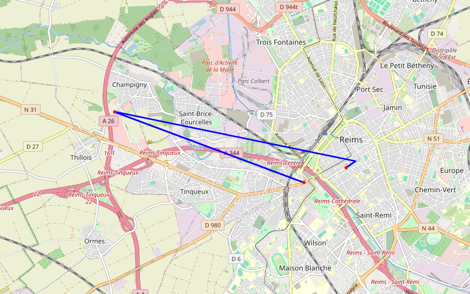

# Escapade à Reims

🌐 Public · 12/12/2025 → 13/12/2025 · 1 jours · 186.6 km · 🇫🇷

_Nous sommes en visite à Reims pour voir nos amis Henri et Liliane. _

---

## 📊 Résumé

| | |
|:---|---:|
| **Date début** | 12/12/2025 |
| **Date fin** | 13/12/2025 |
| **Durée** | 1 jours |
| **Distance** | 186.6 km |
| **Étapes GPS** | 4 |
| **Étapes nommées** | 3 |
| **Pays visités** | 🇫🇷 |
| **Visibilité** | 🌐 Public |
| **Pays** | 🇫🇷 FR |

## 🗺️ Carte du trajet

---

---

## 🗺️ Itinéraire — Étapes

### 1. Reims — 13/12/2025

_La cathédrale _

 *☁️ 9°C*

---

### 2. Champigny — 13/12/2025 *(+5 km)*

_Visite à nos amis Henri et Liliane _

 *☁️ 10°C*

---

### 3. A l'hôpital  — 13/12/2025 *(+4 km)*

_Visite à notre ami Henri avec son epouse Liliane _

 *☁️ 8°C*

---

## 📍 Traces GPS complètes

1 points de tracking automatique :

Afficher la trace GPS

| # | Lieu | Coordonnées | Date | Vitesse |
|:--:|------|:-----------:|:----:|:-------:|
| 1 | Reims | [49.2537, 4.0332](https://maps.google.com/?q=49.2536597,4.0332226) | 13/12/2025 | |

---

[⬅️ Retour aux voyages](../)
