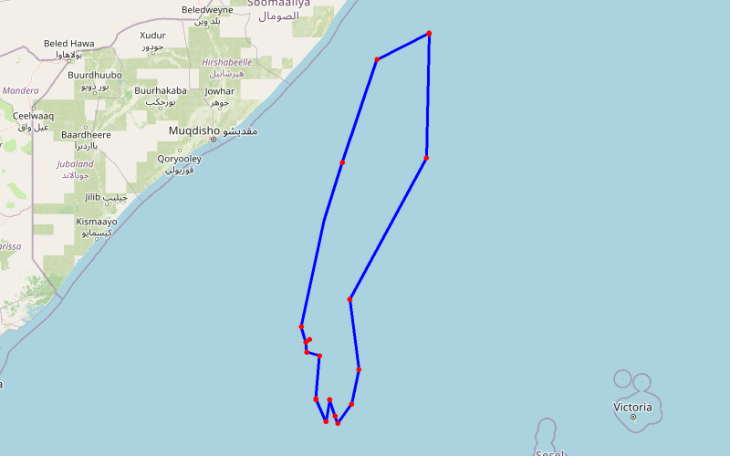

# Tic&Tac à Berck & Bretagne

🌐 Public · 16/04/2025 → 05/05/2025 · 19 jours · 1,766.2 km · 🇧🇪 🇫🇷

---

## 📊 Résumé

| | |
|:---|---:|
| **Date début** | 16/04/2025 |
| **Date fin** | 05/05/2025 |
| **Durée** | 19 jours |
| **Distance** | 1,766.2 km |
| **Étapes GPS** | 44 |
| **Étapes nommées** | 21 |
| **Pays visités** | 🇧🇪 🇫🇷 |
| **Visibilité** | 🌐 Public |
| **Pays** | 🇧🇪 BE, 🇫🇷 FR |

## 🗺️ Carte du trajet

---

---

## 🗺️ Itinéraire — Étapes

### 1. Sombreffe — 18/04/2025

_Départ de l'aventure de Tic&Tac sur les routes de la côte d'Opale et de Bretagne. Voyage pour Tac d'une semaine et Tic deux semaines. _

 *☀️ 15°C*

---

### 2. Merlimont — 18/04/2025

_Une halte à Merlimont, au camping les Jardins de la mer, pour se rendre ensuite aux Cerfs-Volants de Berck._

 *☀️ 19°C*

---

### 3. Hirel — 20/04/2025

_Arrêt au Camping-Car Parc à Hirel prés de Cancales avec un passage en Normandie sur la Plage de Omaha avec un détour au Mont Saint-Michel. _

 *⛅ 15°C*

---

### 4. Perros-Guirec — 22/04/2025

_Sur la route du camping « les Ranolien », nous avons été émerveillés par le Fort la Latte, le Cap Fréhel et le Gouffre de Plougrescant. À Ploumanach, nous avons suivi le sentier des douaniers pour contempler la côte de granit rose et découvert la presqu’île de Renote._

 *⛅ 16°C*

---

### 5. Plounéour-Brignogan-Plages — 24/04/2025

_Entre Péros et Brignogan, notre chemin nous mènera à l'Île de Callot et au Rocher du Singe. Nous sommes au camping 🏕️ de la Côte des Legendes_

 *⛅ 14°C*

---

### 6. Pointe Saint Mathieu  — 26/04/2025

 *⛅ 14°C*

---

### 7. Camaret sur Mer  — 26/04/2025

 *⛅ 15°C*

---

### 8. Camping Pré de la mer — 26/04/2025

_Nous sommes dans le Finistère au camping "Pré de la Mer" sur la plage de Kervel. Nous prévoyons la visite de Locronan, Plogonnec et Douarnenez.  _

 *⛅ 15°C*

---

### 9. Pointe du Raz  — 28/04/2025

 *☀️ 20°C*

---

### 10. Loctudy — 28/04/2025

_Voilà nous sommes à Loctudy au camping 🏕️ Les Hortensias _

 *☀️ 22°C*

---

### 11. Plobannalec-Lesconil — 29/04/2025

 *☀️ 20°C*

---

### 12. Poul Fétan — 30/04/2025

 *☀️ 26°C*

---

### 13. Carnac — 30/04/2025

_Visite du site des menhirs de Carnac _

 *☀️ 24°C*

---

### 14. Golf du Morbihan  — 01/05/2025

 *⛅ 20°C*

---

### 15. Vannes — 02/05/2025

 *⛅ 24°C*

---

### 16. Asserac  — 02/05/2025

_Nous sommes au camping 🏕️ Me moulin de l'Eclis _

 *⛅ 24°C*

---

### 17. Plage Mine d'Or - Penestin — 03/05/2025

 *☀️ 22°C*

---

### 18. Chartres — 04/05/2025

_Arrêt une nuit et visite de la Cathédrale _

 *⛅ 17°C*

---

### 19. Maison 🏡 Picassiette  — 04/05/2025

 *⛅ 16°C*

---

### 20. Champigny — 05/05/2025

_Visite des nos amis remois_

 *⛅ 13°C*

---

### 21. Sombreffe — 06/05/2025

 *☀️ 14°C*

---

## 📍 Traces GPS complètes

23 points de tracking automatique :

Afficher la trace GPS

| # | Lieu | Coordonnées | Date | Vitesse |
|:--:|------|:-----------:|:----:|:-------:|
| 1 | Lannion | [48.8279, -3.4761](https://maps.google.com/?q=48.8278948,-3.4761253) | 24/04/2025 | |
| 2 | Brignogan-Plages | [48.6716, -4.3285](https://maps.google.com/?q=48.6716419,-4.3285153) | 24/04/2025 | |
| 3 | Plougonvelin | [48.3295, -4.7706](https://maps.google.com/?q=48.3295464,-4.7706354) | 26/04/2025 | |
| 4 | Camaret-sur-Mer | [48.2735, -4.6098](https://maps.google.com/?q=48.2734816,-4.6097882) | 26/04/2025 | |
| 5 | Camaret-sur-Mer | [48.2749, -4.6124](https://maps.google.com/?q=48.2748606,-4.6124274) | 26/04/2025 | |
| 6 | Camaret-sur-Mer | [48.2791, -4.6222](https://maps.google.com/?q=48.2790697,-4.6222494) | 26/04/2025 | |
| 7 | Châteaulin | [48.1167, -4.2729](https://maps.google.com/?q=48.1167204,-4.2728796) | 27/04/2025 | |
| 8 | Quimper | [48.0397, -4.7340](https://maps.google.com/?q=48.0397374,-4.733987) | 28/04/2025 | |
| 9 | Loctudy | [47.8127, -4.1814](https://maps.google.com/?q=47.8127009,-4.1814159) | 28/04/2025 | |
| 10 | Plobannalec-Lesconil | [47.7929, -4.2194](https://maps.google.com/?q=47.7928839,-4.2193567) | 29/04/2025 | |
| 11 | Lorient | [47.8924, -3.1485](https://maps.google.com/?q=47.8923862,-3.1484616) | 30/04/2025 | |
| 12 | Govean | [47.5691, -2.8319](https://maps.google.com/?q=47.5691111,-2.8319384) | 01/05/2025 | |
| 13 | Le Drennec | [47.5759, -2.8213](https://maps.google.com/?q=47.5758958,-2.8213103) | 01/05/2025 | |
| 14 | Arradon | [47.6216, -2.8391](https://maps.google.com/?q=47.6216065,-2.8391275) | 01/05/2025 | |
| 15 | Vannes | [47.6427, -2.7542](https://maps.google.com/?q=47.6427311,-2.7542286) | 02/05/2025 | |
| 16 | Saint-Nazaire | [47.4451, -2.4509](https://maps.google.com/?q=47.4450679,-2.4509027) | 02/05/2025 | |
| 17 | Fay | [48.0031, 0.0953](https://maps.google.com/?q=48.0030765,0.0952716) | 04/05/2025 | |
| 18 | Chartres | [48.4358, 1.5002](https://maps.google.com/?q=48.4358118,1.5002225) | 04/05/2025 | |
| 19 | Chartres | [48.4466, 1.4864](https://maps.google.com/?q=48.4466188,1.4864492) | 04/05/2025 | |
| 20 | Chartres | [48.4422, 1.5068](https://maps.google.com/?q=48.4421641,1.5067973) | 04/05/2025 | |
| 21 | Chartres | [48.4349, 1.4995](https://maps.google.com/?q=48.4349041,1.4995219) | 04/05/2025 | |
| 22 | Champigny | [49.2664, 3.9708](https://maps.google.com/?q=49.2664164,3.970771) | 05/05/2025 | |
| 23 | Sombreffe | [50.5355, 4.6039](https://maps.google.com/?q=50.5355062,4.6038954) | 06/05/2025 | |

---

[⬅️ Retour aux voyages](../)
